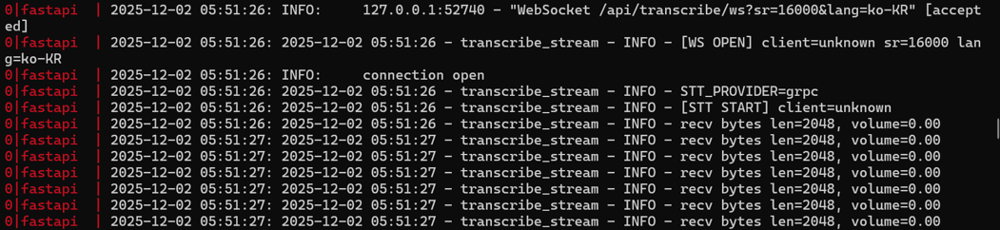

# 🔐 구해줘 피싱(Guppy)
**실시간 보이스피싱·스미싱·문서 위조 탐지 AI 기반 모바일 보안 서비스**

---

## 📝 프로젝트 소개

보이스피싱은 더 이상 고령층만의 문제가 아니라, **전 세대**가 피해를 입는 사회적 문제로 확산되고 있습니다.  
특히 짧은 문장, 링크, 메신저 기반으로 빠르게 실행되는 피싱 범죄는  
사용자가 정상 여부를 판단하기 어렵고, 그 피해 규모 또한 매우 큽니다.

구해줘 피싱(Guppy)은 다음 네 가지 기능을 통합한 **AI 기반 실시간 탐지 플랫폼**입니다:

1. **실시간 통화 음성(STT) 기반 보이스피싱 위험 탐지**
2. **문서 직인·레이아웃 분석 기반 위조 판별**
3. **문자 본문·URL 분리 기반 스미싱 분석**
4. **사용자 맞춤형 위험 번호 추천 기능**

---

## 👥 팀 구성

|||||||
|:-:|:-:|:-:|:-:|:-:|:-:|
|[박윤호](https://github.com/nini4746)|[YEOUL](https://github.com/YEOUL0520)|[ychoik](https://github.com/haycho33)|[Hyeonsoo Choi](https://github.com/NockDu)|[Kimminseo1104](https://github.com/Kimminseo1104)|[SUNGHYUN](https://github.com/Ahrasblue)|
|백엔드 / 서버 개발|팀장 · 앱 개발|문서 위조 CV 모델|오디오/STT 기능 개발|OCR/문자 분석|UI/UX 디자인|

---

## 🧩 팀 역할별 책임 정리표 (Responsibility Matrix)

| 팀원 | 주요 역할 | 상세 책임 |
|------|-----------|------------|
| **YEOUL (팀장)** | Android App / 전체 구조 설계 | • Jetpack Compose 기반 UI 구현 • WebSocket 통화 전송 구조 개발 • 스미싱/문자 분석 UI 흐름 구현 • 프로젝트 구조 및 품질 관리 |
| **박윤호** | Backend / FastAPI 서버 개발 | • STT·CV·OCR 모듈 통합 API 개발 • WebSocket 서버 구조 설계 • 위험도 계산 로직 구현 • 서버 로그/테스트 시스템 운영 |
| **ychoik** | 문서 위조 Computer Vision | • 직인 검출 알고리즘 개발(OpenCV) • 레이아웃 구조 분석 모델 설계 • 문서 위조 위험도 산정 알고리즘 개발 |
| **Hyeonsoo Choi** | 오디오 분석 / STT | • PCM 캡처 및 오디오 처리 설계 • 실시간 STT 파이프라인 구성 • 피싱 키워드 탐지 로직 개발 |
| **Kimminseo1104** | OCR · 문자 분석 | • 문자→URL 분리 알고리즘 구현 • 위험 키워드 탐지 모델 개발 • 스미싱 DB 구축 및 연동 |
| **SUNGHYUN** | UI/UX 디자인 | • 앱 전체 UX 흐름 설계 • 피싱/위조 결과 시각화 디자인 • 사용자 편의성 개선 요소 설계 |

---

## ⚙️ 개발 환경
- **App** : Android Kotlin(Jetpack Compose)
- **Backend** : FastAPI, WebSocket
- **AI/ML** : OpenCV, OCR, STT, Layout Detection
- **Tools** : Android Studio / VS Code / GitHub / Figma
- **DB** : SQLite(Local) + 확장 가능 아키텍처

### OneUI 기반 안드로이드 14의 음성 권한

| API / 클래스      | 동작 및 제한 사항 |
|-------------------|-------------------|
| **AudioRecord**   | `VOICE_COMMUNICATION`, `VOICE_RECOGNITION`과 함께 사용 시 차단 |
| **VOICE_CALL**    | `start()` 자체가 실패하거나, 음성이 0으로 처리되어 권한이 완전히 차단됨 |
| **MediaRecorder** | 통화 연결 시 자동으로 음성이 0으로 처리되며, 녹음 파일은 생성되지만 빈 파일로 생성됨 |

> 안드로이드 12 이상부터 통화 녹음이 사실상 완전히 차단되며,  
> OneUI 환경에서는 일반 녹음까지 추가로 제한됨.

이로 인해, 앱 내 **실시간 통화 캡처 방식** 대신  
현재는 **통화 종료 후 음성 파일 업로드 방식**으로 기능을 대체하였음.

#### 실시간 음성 스트리밍 테스트 페이지

안드로이드 권한 제약 하에서도 **WebSocket → gRPC → STT 파이프라인이 정상 동작함을 검증하고,  
동시에 “볼륨 0” 이슈를 재현·설명하기 위해** 아래와 같은 실시간 음성 스트리밍 테스트 페이지를 구성하였음.

https://antiphishingstt.p-e.kr/

#### 테스트 환경 (전화 / 문자 공통)

- **발신자 단말**
  - Wi-Fi / 모바일 데이터 OFF  
  - 메세지 플러스, 데이터 기반 통화(VoLTE 등)를 방지하기 위함
  - 위 기능들을 사용하며 실시간 통화 녹음 및 스미싱 분석은 통신사 및 휴대폰 제조사 권한이 필요

- **수신자 단말**
  - 모바일 데이터 ON  
  - 서버와의 WebSocket / HTTP 통신 및 알림 수신용

#### 실시간 스트리밍 테스트 로그

앱 측 로그:

서버 측 로그:

위 로그를 통해 다음을 확인할 수 있음.

- WebSocket 엔드포인트 `/api/transcribe/ws?sr=16000&lang=ko-KR` 로의 연결은 정상적으로 수립되고  
- 서버에서 gRPC 기반 CLOVA STT 세션이 정상적으로 시작되며  
- `recv bytes len=2048` 로그가 주기적으로 출력되는 것으로 보아 **PCM 스트림 수신 자체는 정상 동작**함  

다만, **Android 14 / OneUI의 통화 녹음 차단 정책으로 인해**  
실제 통화 음성이 아닌, **볼륨이 0으로 처리된 오디오 데이터만 전달**되고 있음.

따라서,

> 기능(연결, 스트리밍, 서버 파이프라인)은 정상적으로 동작하지만,  
> **권한 문제로 인해 서버에 수신되는 `volume` 값이 모두 `0.00`이며  
> 실질적인 통화 음성 신호는 전달되지 않는 상태**임을 확인할 수 있음.

---

## 📌 주요 기능

### 🔊 1) 보이스피싱 위험 탐지 (Real-time STT)
- PCM 기반 WebSocket 전송
- 실시간 STT 변환 후 위험도 분석
- 통화 중 즉시 사용자에게 경고 표시

### 🖼 2) 문서 위조 탐지 (OCR + CV + Layout)
- 직인 위치 분석
- 영역 구조 비교
- 비정상 패턴 탐지
- 위험도 시각화 및 이미지 오버레이 제공

### 💬 3) 스미싱 분석
- 문자 본문과 URL 자동 분리
- 키워드 기반 위험 점수화
- URL 도메인 위험도 비교
- 정렬 및 검색 기능 지원

### 📞 4) 위험 번호 추천
- 사용자 패턴 분석
- 개인화된 피싱 의심 번호 제공
- 신종 패턴 자동 반영

---

## 🧱 전체 시스템 구조

- **App → WebSocket(Server)** : 실시간 Audio/PCM 스트림 전송  
- **Server → AI Pipeline** : STT / CV / OCR / URL 분석  
- **Server → App** : 위험도 + 분석 결과 전달  
- **App** : UI 시각화 및 사용자 알림  

---

## 🔮 향후 확장

- AI 기반 신종 패턴 자동 탐지
- 가족 보호 기능 (원격 위험 모니터링)
- 공공기관 연계 데이터 허브 구축
- 금융기관 FDS 연동 모델 제공

---

## 📚 참고 자료  
본 README 문서는 SW공학 발표 자료를 기반으로 작성되었습니다.  

- [SRS (Software Requirement Specification)](./srs.md) - 프로젝트 요구사항 문서
- [SDS (Software Requirement Specification)](./sds.md) - 프로젝트 설계 명세서
