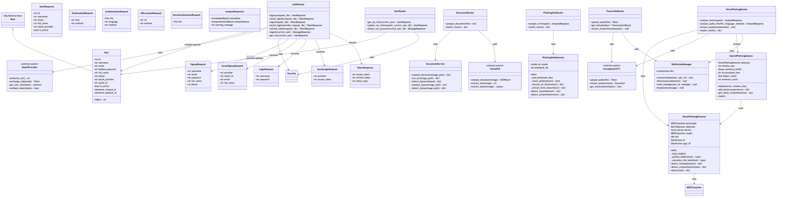
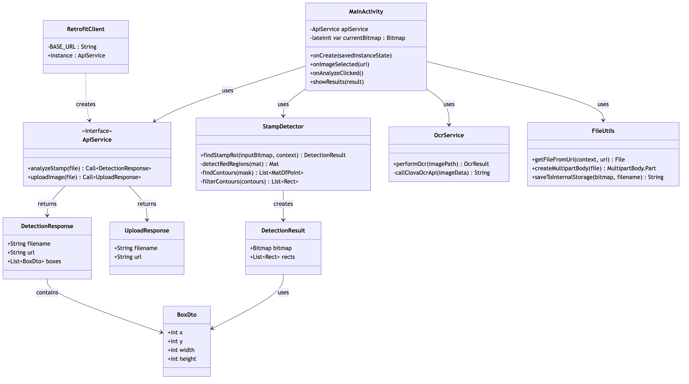
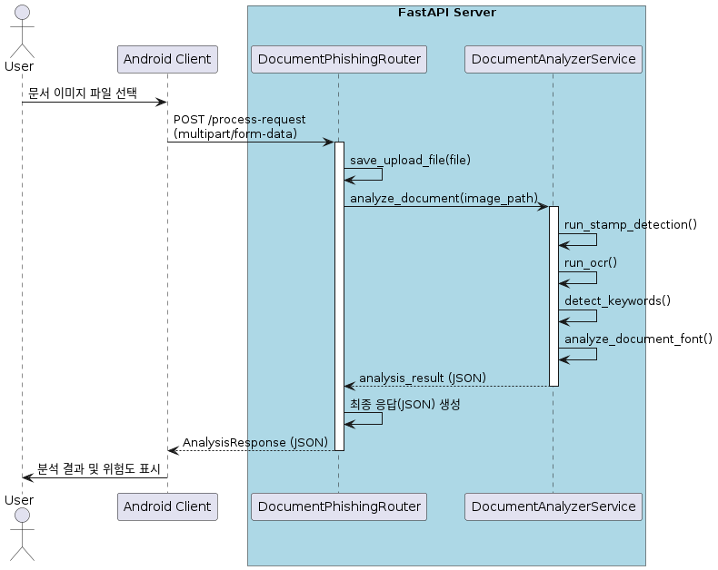
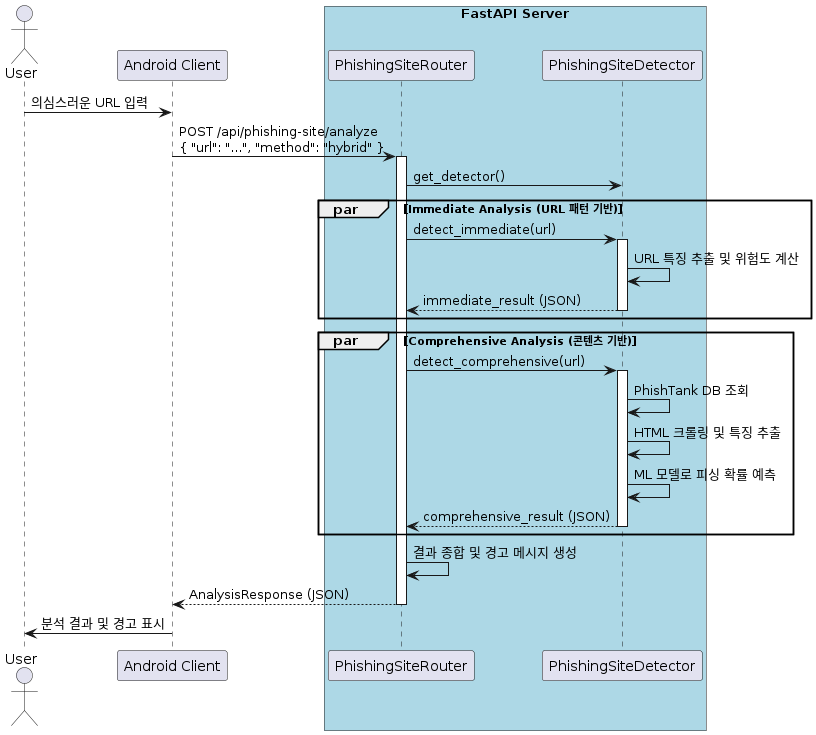

# Software Design Specification (SDS)
## 피싱 탐지 시스템 (Phishing Detection System)

### Team Members
| Student ID | Name   |
|------------|--------|
| 22012286   | 김민서 |
| 22010958   | 김성현 |
| 22112144   | 류효정 |
| 22012124   | 박윤호 |
| 22212125   | 윤찬익 |
| 22112102   | 최현수 |

## Content
1. [Introduction](#1-introduction)
2. [Use Case Analysis](#2-use-case-analysis)
3. [Class Diagrams](#3-class-diagrams)
4. [Sequence Diagrams](#4-sequence-diagrams)
5. [State Machine Diagrams](#5-state-machine-diagrams)
6. [User Interface Design](#6-user-interface-design)
7. [Implementation Requirements](#7-implementation-requirements)
8. [Glossary](#8-glossary)
9. [References](#9-references)

## Authors for each section

Introduction

Use Case Analysis

Class Diagrams

Sequence Diagrams

State Machine Diagrams

User Interface Design

Implementation Requirements

Glossary

References

## 1. Introduction

## 2. Use Case Analysis
이번 장은 Use case diagram과 Use case description을 제공한다. Diagram에 관한
고려 사항은 다음과 같다.

● Use case diagram은 description에 대한 부가적인 결과물이다. 이 문서를 읽는 독자는 use case diagram보다 use case description에서 충분한 정보를 얻을 수 있으니 꼭 참고하길 바란다. 
● 본 프로젝트 대부분의 기능들은 로그인을 하지 않으면 기능을 이용할 수 없다.(회원가입 기능은 제외) 
● 본 프로젝트의 Use case는 총 9가지로, 각각의 Use case는 다음과 같은 기능들을 포괄한다. 

-회원가입: 사용자가 아이디, 비밀번호 등 기본 정보를 입력하여 새로운 계정을 생성하는 기능. 

-소셜 회원가입: 소셜 로그인 시 가입 정보가 없을 경우, 외부 서비스 프로필을 기반으로 간편하게 신규 계정을 생성하는 기능. 

-로그인: 가입된 사용자가 아이디와 비밀번호로 시스템에 접근 권한을 인증받는 기능. 

-소셜 로그인: 사용자가 외부 인증 서비스 계정을 통해 간편하게 로그인하는 기능. 

-내 정보 조회: 로그인된 사용자가 자신의 가입 정보를 확인하고 수정하는 기능. 

-통화 녹음본 보이스피싱 탐지: 사용자가 업로드한 녹음 파일을 서버로 보내 텍스트로 변환하고 보이스피싱 위험도를 분석하는 기능. 

-실시간 통화 보이스피싱 탐지: 사용자의 마이크 입력을 실시간으로 스트리밍하여 텍스트로 변환하고 보이스피싱 위험도를 즉시 탐지하는 기능. 

-피싱 사이트 탐지: 메시지 등에 포함된 URL이 피싱 사이트인지 다층적인 방법(DB,ML, 규칙)으로 분석하는 기능. 

-문서 위조 분석: 사용자가 업로드한 문서 이미지의 직인, 레이아웃, 키워드 등을 분석하여 위조 위험도를 측정하는 기능. 

### 2.1 Use case Diagram

### 2.2 Use case Description
<h2>Use case #1 : 회원가입 (Sign Up)</h2>

<table border="1" cellpadding="6" cellspacing="0" width="980" align="center">
  <colgroup>
    <col width="25%">
    <col>
  </colgroup>

  <!-- GENERAL CHARACTERISTICS -->
  <tr><td colspan="2"><strong>GENERAL CHARACTERISTICS</strong></td></tr>
  <tr><td><strong>Summary</strong></td><td>사용자가 시스템 이용을 위해 개인 정보를 입력하고 계정을 생성하는 기능</td></tr>
  <tr><td><strong>Scope</strong></td><td>Anti-Phishing-App</td></tr>
  <tr><td><strong>Level</strong></td><td>User level</td></tr>
  <tr><td><strong>Author</strong></td><td>Anti-Phishing-App_Team</td></tr>
  <tr><td><strong>Last Update</strong></td><td>2025.10.26</td></tr>
  <tr><td><strong>Status</strong></td><td>Analysis</td></tr>
  <tr><td><strong>Primary Actor</strong></td><td>사용자</td></tr>
  <tr>
    <td><strong>Preconditions</strong></td>
    <td>
      클라이언트와 서버 간 네트워크가 정상이어야 한다. 
      서버 프로세스가 구동 중이어야 한다. 
      DB 연결이 가능해야 한다. 
      사용자는 아직 해당 아이디로 가입되어 있지 않아야 한다.
    </td>
  </tr>
  <tr>
    <td><strong>Trigger</strong></td>
    <td>사용자가 회원가입 페이지에 접근하여 이름, 아이디, 비밀번호 등 필수 정보를 입력하고 ‘회원가입’ 버튼을 클릭할 때</td>
  </tr>
  <tr>
    <td><strong>Success Post Condition</strong></td>
    <td>DB에 새 사용자 레코드가 생성되고(비밀번호는 해시로 저장), 서버는 201 Created와 함께 성공 메시지를 반환한다.</td>
  </tr>
  <tr>
    <td><strong>Failed Post Condition</strong></td>
    <td>
      검증 실패, 중복 아이디, DB 오류 등으로 인해 계정이 정상적으로 생성되지 않는다. 
      서버는 실패 원인에 따라 적절한 HTTP 상태코드(400, 409, 422, 500, 503 등)와 
      구체적인 오류 메시지(JSON)를 반환한다. 
      입력값 누락이나 비밀번호 정책 위반 시에는 클라이언트가 화면에서 즉시 오류 메시지를 표시하고, 중복 아이디나 DB 트랜잭션 실패의 경우 서버 로그에 상세 오류 내역(요청 시간, 원인 코드, 사용자 입력값 일부)을 기록한다.
    </td>
  </tr>

  <!-- MAIN SUCCESS SCENARIO -->
  <tr><td colspan="2"><strong>MAIN SUCCESS SCENARIO</strong></td></tr>
  <tr><td><strong>Step</strong></td><td><strong>Action</strong></td></tr>
  <tr><td align="center">S</td><td>사용자가 회원가입 화면을 연다.</td></tr>
  <tr><td align="center">1</td><td>사용자: 아이디/비밀번호/닉네임 등 필수값 입력 후 제출한다.</td></tr>
  <tr><td align="center">2</td><td>서버: DB에서 아이디 중복 여부 조회.</td></tr>
  <tr><td align="center">3</td><td>서버: 중복이 아니면 비밀번호 해시 생성(bcrypt) 및 사용자 레코드 생성 트랜잭션 시작.</td></tr>
  <tr><td align="center">4</td><td>서버: 사용자 정보를 DB에 커밋 후 성공 로그 기록.</td></tr>
  <tr><td align="center">5</td><td>서버→클라이언트: 201 Created + {"message":"registered"} 반환.</td></tr>

  <!-- EXTENSION SCENARIOS -->
  <tr><td colspan="2"><strong>EXTENSION SCENARIOS</strong></td></tr>
  <tr><td><strong>Step</strong></td><td><strong>Branching Action / Result (HTTP)</strong></td></tr>
  <tr><td align="center">2</td><td>2a. 사용자가 필수 입력값을 누락하거나 형식이 잘못된 경우, 서버는 422 Unprocessable Entity를 반환</td></tr>
  <tr><td align="center">2</td><td>2b. 비밀번호가 정책(8자 이상, 문자+숫자 조합)을 만족하지 않으면 400 Bad Request를 반환</td></tr>
  <tr><td align="center">3</td><td>3a. 이미 존재하는 아이디로 가입을 시도하면 서버는 409 Conflict를 반환</td></tr>
  <tr><td align="center">4</td><td>4a. 비밀번호 해시 생성 과정에서 오류가 발생하면 서버는 500 Internal Server Error를 반환</td></tr>
  <tr><td align="center">5</td><td>5a. 데이터베이스 연결이 끊기거나 트랜잭션이 실패하면 서버는 500 Internal Server Error 또는 503 Service Unavailable을 반환</td></tr>
  <tr><td align="center">5</td><td>5b. DB 응답이 지연되면 서버는 504 Gateway Timeout을 반환</td></tr>

  <!-- RELATED INFORMATION -->
  <tr><td colspan="2"><strong>RELATED INFORMATION</strong></td></tr>
  <tr><td><strong>Performance</strong></td><td>≤ 2s</td></tr>
  <tr><td><strong>Frequency</strong></td><td>제한 없음</td></tr>
  <tr><td><strong>&lt;Concurrency&gt;</strong></td><td>제한 없음</td></tr>
  <tr><td><strong>Due Date</strong></td><td></td></tr>
</table>

<h2>Use case #2 : 소셜 회원가입 (Sign-Up with OAuth)</h2>

<table border="1" cellpadding="6" cellspacing="0" width="980" align="center">
  <colgroup>
    <col width="25%">
    <col>
  </colgroup>

  <!-- GENERAL CHARACTERISTICS -->
  <tr><td colspan="2"><strong>GENERAL CHARACTERISTICS</strong></td></tr>
  <tr>
    <td><strong>Summary</strong></td>
    <td>
      사용자가 Google, Naver, Kakao 등 외부 소셜 계정(OAuth 2.0)을 이용하여 처음으로 시스템에 가입하는 기능이다. 
      서버는 Provider로부터 전달받은 Access Token과 사용자 정보를 검증한 뒤, DB에 신규 사용자 정보를 저장하고 JWT를 발급한다.
    </td>
  </tr>
  <tr><td><strong>Scope</strong></td><td>Anti-Phishing-App</td></tr>
  <tr><td><strong>Level</strong></td><td>User level</td></tr>
  <tr><td><strong>Author</strong></td><td>Anti-Phishing-App_Team</td></tr>
  <tr><td><strong>Last Update</strong></td><td>2025.11.05</td></tr>
  <tr><td><strong>Status</strong></td><td>Analysis</td></tr>
  <tr><td><strong>Primary Actor</strong></td><td>사용자</td></tr>
  <tr>
    <td><strong>Preconditions</strong></td>
    <td>
      1.클라이언트와 서버 간 네트워크가 정상이어야 한다. 
      2.FastAPI 서버 및 DB 연결이 정상 상태여야 한다. 
      3.사용자는 Google, Naver, Kakao 등 OAuth Provider 계정을 보유하고 있어야 한다. 
      4.해당 소셜 계정은 아직 시스템 DB에 등록되지 않은 상태여야 한다. 
      5.OAuth Provider의 인증 서버와 Redirect URI 설정이 완료되어 있어야 한다.
    </td>
  </tr>
  <tr>
    <td><strong>Trigger</strong></td>
    <td>사용자가 로그인 화면에서 “Google로 로그인” 등 소셜 로그인을 시도했으나, 해당 소셜 계정이 시스템 DB에 존재하지 않아 회원가입 절차로 분기되는 경우. 또는 사용자가 직접 “소셜 계정으로 회원가입” 버튼을 눌러 OAuth 인증을 시작하는 경우.</td>
  </tr>
  <tr>
    <td><strong>Success Post Condition</strong></td>
    <td>
      1.서버는 Provider로부터 받은 사용자 정보를 바탕으로 신규 사용자 레코드를 생성한다. 
      2.회원정보가 DB에 성공적으로 저장되면, JWT Access Token을 발급하고 201 Created와 함께 응답을 반환한다. 
      3.가입 직후 사용자는 자동으로 로그인된 상태가 된다.
    </td>
  </tr>
  <tr>
    <td><strong>Failed Post Condition</strong></td>
    <td>
      Access Token 검증 실패, 사용자 정보 미수신, 중복 가입, DB 오류 등의 이유로 회원 생성이 완료되지 않으면 서버는 사용자 레코드를 저장하지 않고, 상황에 맞는 HTTP 상태코드 및 오류 메시지(JSON)를 반환한다. 
      오류 내용은 서버 로그에 기록된다.
    </td>
  </tr>

  <!-- MAIN SUCCESS SCENARIO -->
  <tr><td colspan="2"><strong>MAIN SUCCESS SCENARIO</strong></td></tr>
  <tr><td><strong>Step</strong></td><td><strong>Action</strong></td></tr>
  <tr><td align="center">S</td><td>사용자가 로그인 또는 회원가입 화면에서 “소셜 계정으로 가입” 버튼을 클릭한다.</td></tr>
  <tr><td align="center">1</td><td>클라이언트는 사용자가 선택한 Provider(Google, Naver, Kakao 등)의 인증 페이지로 리디렉션한다.</td></tr>
  <tr><td align="center">2</td><td>사용자가 해당 Provider 로그인 페이지에서 인증을 완료하고, 접근 권한을 허용한다.</td></tr>
  <tr><td align="center">3</td><td>Provider는 인가 코드(Authorization Code) 또는 Access Token을 시스템 서버의 Redirect URI로 전달한다.</td></tr>
  <tr><td align="center">4</td><td>서버는 전달받은 코드로 Provider API를 호출하여 Access Token을 교환하고 사용자 정보를 요청한다. (이메일, 이름, 프로필 이미지 등)</td></tr>
  <tr><td align="center">5</td><td>서버는 Provider가 반환한 사용자 정보의 무결성을 검증하고, DB에서 동일한 이메일 또는 Provider ID가 이미 존재하는지 확인한다.</td></tr>
  <tr><td align="center">6</td><td>DB에 해당 사용자가 존재하지 않으면, 서버는 새 사용자 레코드를 생성한다. 비밀번호는 소셜 계정 기반이므로 별도의 입력 없이 Provider ID 또는 고유 키로 대체 저장한다.</td></tr>
  <tr><td align="center">7</td><td>서버는 신규 사용자 정보를 DB에 커밋하고, 성공 로그를 기록한다.</td></tr>
  <tr><td align="center">8</td><td>서버는 신규 가입 사용자에게 JWT Access Token을 발급하여 응답 본문에 포함하고, 201 Created 상태로 반환한다.</td></tr>
  <tr><td align="center">9</td><td>클라이언트는 토큰을 저장하고, 사용자를 자동 로그인 상태로 전환한다. 사용자는 가입 직후 보호된 API를 이용할 수 있다.</td></tr>

  <!-- EXTENSION SCENARIOS -->
  <tr><td colspan="2"><strong>EXTENSION SCENARIOS</strong></td></tr>
  <tr><td><strong>Step</strong></td><td><strong>Branching Action / Result (HTTP)</strong></td></tr>
  <tr><td align="center">2</td><td>2a.사용자가 Provider 로그인 중 인증을 취소하거나 창을 닫으면, 시스템은 회원가입 절차를 중단하고 “소셜 인증이 취소되었습니다.” 메시지를 표시한다.</td></tr>
  <tr><td align="center">2</td><td>3a.서버가 Redirect URI에서 인가 코드를 받지 못하거나 잘못된 코드가 전달된 경우, 400 Bad Request와 “잘못된 인증 요청입니다.” 메시지를 반환한다.</td></tr>
  <tr><td align="center">4</td><td>4a.Provider API 요청 중 네트워크 오류가 발생하거나 응답이 지연될 경우, 서버는 504 Gateway Timeout을 반환하고 “외부 인증 서버 응답 지연” 메시지를 표시한다.</td></tr>
  <tr><td align="center">4</td><td>4b.Access Token 요청이 실패하거나 Provider로부터 “invalid_client” 오류가 발생한 경우, 서버는 401 Unauthorized를 반환하고 “소셜 인증에 실패했습니다.” 메시지를 표시한다.</td></tr>
  <tr><td align="center">5</td><td>5a. Provider가 사용자 정보를 반환하지 않거나 필수 항목(이메일 등)이 누락된 경우, 서버는 400 Bad Request를 반환하고 “필수 사용자 정보가 없습니다.” 메시지를 표시한다.</td></tr>
  <tr><td align="center">5</td><td>5b.DB 조회 결과 동일한 이메일 또는 Provider ID가 이미 존재하면, 서버는 409 Conflict를 반환하고 “이미 등록된 소셜 계정입니다.” 메시지를 표시한다.</td></tr>
  <tr><td align="center">6</td><td>6a. DB 트랜잭션 중 오류가 발생하거나 연결이 끊기면, 서버는 500 Internal Server Error 또는 503 Service Unavailable을 반환한다.</td></tr>
  <tr><td align="center">7</td><td>7a.서버 로그 기록 또는 커밋 과정에서 예외가 발생하면, 회원 정보는 저장되었더라도 200 OK 대신 206 Partial Content로 응답하고 로그 경고를 남긴다.</td></tr>
  <tr><td align="center">8</td><td>8a. JWT 생성 중 내부 오류가 발생하면, 서버는 500 Internal Server Error를 반환하고 “토큰 발급 중 오류가 발생했습니다.” 메시지를 표시한다.</td></tr>
  <tr><td align="center">9</td><td>9a.클라이언트가 JWT를 저장하는 과정에서 오류가 발생하면, 앱은 “로그인 상태를 유지할 수 없습니다.” 메시지를 표시하고 재로그인을 요청한다.</td></tr>

  <!-- RELATED INFORMATION -->
  <tr><td colspan="2"><strong>RELATED INFORMATION</strong></td></tr>
  <tr><td><strong>Performance</strong></td><td>≤ 2s</td></tr>
  <tr><td><strong>Frequency</strong></td><td>제한 없음</td></tr>
  <tr><td><strong>&lt;Concurrency&gt;</strong></td><td>제한 없음</td></tr>
  <tr><td><strong>Due Date</strong></td><td></td></tr>
</table>

<h2>Use case #3 : 로그인 (Login)</h2>

<table border="1" cellpadding="6" cellspacing="0" width="980" align="center">
  <colgroup>
    <col width="25%">
    <col>
  </colgroup>

  <!-- GENERAL CHARACTERISTICS -->
  <tr><td colspan="2"><strong>GENERAL CHARACTERISTICS</strong></td></tr>
  <tr><td><strong>Summary</strong></td><td>등록된 계정으로 인증하면 서버가 자격 증명 검증 → JWT 발급을 수행하고, 성공 시 보호된 API 접근을 허용한다.</td></tr>
  <tr><td><strong>Scope</strong></td><td>Anti-Phishing-App</td></tr>
  <tr><td><strong>Level</strong></td><td>User level</td></tr>
  <tr><td><strong>Author</strong></td><td>Anti-Phishing-App_Team</td></tr>
  <tr><td><strong>Last Update</strong></td><td>2025.10.26</td></tr>
  <tr><td><strong>Status</strong></td><td>Analysis</td></tr>
  <tr><td><strong>Primary Actor</strong></td><td>사용자</td></tr>
  <tr>
    <td><strong>Preconditions</strong></td>
    <td>
      1. 사용자는 회원가입을 완료해야 한다. 
      2. 시스템 서버와 데이터베이스가 정상적으로 동작 중이어야 한다.
    </td>
  </tr>
  <tr>
    <td><strong>Trigger</strong></td>
    <td>사용자가 로그인 화면에서 아이디/비밀번호를 입력하고 로그인을 클릭하거나, 클라이언트가 POST /auth/login을 호출</td>
  </tr>
  <tr>
    <td><strong>Success Post Condition</strong></td>
    <td>서버가 자격 증명을 검증하고 JWT 액세스 토큰을 발급하여 200 OK와 함께 반환</td>
  </tr>
  <tr>
    <td><strong>Failed Post Condition</strong></td>
    <td>인증에 실패하거나 내부 오류가 발생하면 JWT 토큰은 발급되지 않으며 세션/쿠키도 생성되지 않는다. 서버는 실패 유형에 따라 적절한 HTTP 상태코드(400/401/422/429/423/500/503 등)와 구체적 오류 메시지(JSON)를 반환하고, 클라이언트는 오류 원인을 화면에 표시하여 재시도·비밀번호 재설정·추가 인증 유도 등 대응을 안내한다.</td>
  </tr>

  <!-- MAIN SUCCESS SCENARIO -->
  <tr><td colspan="2"><strong>MAIN SUCCESS SCENARIO</strong></td></tr>
  <tr><td><strong>Step</strong></td><td><strong>Action</strong></td></tr>
  <tr><td align="center">S</td><td>사용자가 로그인 화면을 연다.</td></tr>
  <tr><td align="center">1</td><td>사용자: 아이디/비밀번호 입력 후 제출.</td></tr>
  <tr><td align="center">2</td><td>서버: 입력 검증(필수값/포맷) 수행.</td></tr>
  <tr><td align="center">3</td><td>서버: DB에서 사용자 조회, 존재 여부 확인.</td></tr>
  <tr><td align="center">4</td><td>서버: 저장된 비밀번호 해시 검증(bcrypt) — 일치하지 않으면 실패.</td></tr>
  <tr><td align="center">5</td><td>서버: JWT 생성</td></tr>
  <tr><td align="center">6</td><td>서버→클라이언트: 200 OK + {access_token, token_type} 반환 & 성공 로그.</td></tr>

  <!-- EXTENSION SCENARIOS -->
  <tr><td colspan="2"><strong>EXTENSION SCENARIOS</strong></td></tr>
  <tr><td><strong>Step</strong></td><td><strong>Branching Action / Result (HTTP)</strong></td></tr>
  <tr><td align="center">2</td><td>2a. 사용자가 아이디나 비밀번호를 입력하지 않으면 서버는 422 Unprocessable Entity를 반환하고 "아이디와 비밀번호를 입력해주세요." 메시지를 표시</td></tr>
  <tr><td align="center">3</td><td>3a. 입력한 아이디가 존재하지 않으면 서버는 401 Unauthorized를 반환하고 "아이디 또는 비밀번호가 올바르지 않습니다." 메시지를 표시</td></tr>
  <tr><td align="center">4</td><td>4a.비밀번호가 일치하지 않으면 서버는 401 Unauthorized를 반환하고 동일하게 "아이디 또는 비밀번호가 올바르지 않습니다." 메시지를 표시</td></tr>
  <tr><td align="center">5</td><td>5a. JWT 토큰 생성 중 내부 오류나 키 로드 실패가 발생하면 서버는 500 Internal Server Error를 반환하고 "서버 오류로 로그인에 실패했습니다." 메시지를 표시</td></tr>
  <tr><td align="center">5</td><td>5b. 데이터베이스 연결 또는 쿼리 오류가 발생하면 서버는 500 Internal Server Error 또는 503 Service Unavailable을 반환하고 "일시적 서버 오류입니다. 잠시 후 다시 시도해주세요." 메시지를 표시</td></tr>
  <tr><td align="center">6</td><td>6a. 너무 많은 로그인 시도가 감지되면 서버는 429 Too Many Requests를 반환하고 "시도가 많습니다. 잠시 후 다시 시도해주세요." 메시지를 표시</td></tr>
  <tr><td align="center">6</td><td>6b. 연속된 실패로 계정이 잠금 상태이면 서버는 423 Locked를 반환하고 "보안을 위해 계정이 잠겼습니다. 비밀번호를 재설정해주세요." 메시지를 표시</td></tr>

  <!-- RELATED INFORMATION -->
  <tr><td colspan="2"><strong>RELATED INFORMATION</strong></td></tr>
  <tr><td><strong>Performance</strong></td><td>≤ 2s</td></tr>
  <tr><td><strong>Frequency</strong></td><td>제한 없음</td></tr>
  <tr><td><strong>&lt;Concurrency&gt;</strong></td><td>제한 없음</td></tr>
  <tr><td><strong>Due Date</strong></td><td></td></tr>
</table>

<h2>Use case #4 : 소셜 로그인 (Social Login - OAuth 2.0)</h2>

<table border="1" cellpadding="6" cellspacing="0" width="980" align="center">
  <colgroup>
    <col width="25%">
    <col>
  </colgroup>

  <!-- GENERAL CHARACTERISTICS -->
  <tr><td colspan="2"><strong>GENERAL CHARACTERISTICS</strong></td></tr>
  <tr>
    <td><strong>Summary</strong></td>
    <td>
      사용자가 Google, Naver, Kakao 등 외부 OAuth 제공자를 통해 로그인 요청을 하면,서버는 Access Token을 검증하여 사용자 정보를 가져오고,등록된 계정일 경우 JWT를 발급해 인증 세션을 생성한다. 
      신규 사용자일 경우 “소셜 회원가입” 단계로 분기한다.
    </td>
  </tr>
  <tr><td><strong>Scope</strong></td><td>Anti-Phishing-App</td></tr>
  <tr><td><strong>Level</strong></td><td>User level</td></tr>
  <tr><td><strong>Author</strong></td><td>Anti-Phishing-App_Team</td></tr>
  <tr><td><strong>Last Update</strong></td><td>2025.11.05</td></tr>
  <tr><td><strong>Status</strong></td><td>Analysis</td></tr>
  <tr><td><strong>Primary Actor</strong></td><td>사용자</td></tr>
  <tr>
    <td><strong>Preconditions</strong></td>
    <td>
      1.사용자는 이미 해당 소셜 계정(Google, Naver, Kakao 등)을 보유하고 있어야 한다. 
      2.소셜 로그인 공급자(OAuth Provider)의 인증 서버가 정상 작동 중이어야 한다. 
      3.서버는 OAuth Redirect URI로 등록되어 있어야 한다. 
      4.데이터베이스 연결 및 JWT 서명 키가 유효해야 한다.
    </td>
  </tr>
  <tr>
    <td><strong>Trigger</strong></td>
    <td>사용자가 로그인 화면에서 소셜 로그인 버튼을 클릭한다. 또는 클라이언트가 소셜 로그인 엔드포인트를 호출하여 OAuth 인증 절차를 시작한다.</td>
  </tr>
  <tr>
    <td><strong>Success Post Condition</strong></td>
    <td>
      서버가 외부 OAuth Provider로부터 전달받은 Access Token을 검증하고, 
      해당 계정이 시스템 DB에 존재하면 JWT Access Token을 발급하여 200 OK와 함께 반환한다. 
      사용자는 즉시 로그인된 상태로 보호된 API를 사용할 수 있다.
    </td>
  </tr>
  <tr>
    <td><strong>Failed Post Condition</strong></td>
    <td>
      Access Token 검증 실패, 등록되지 않은 사용자, 네트워크 장애, 또는 Provider 응답 오류가 발생하면 
      JWT가 발급되지 않는다. 
      서버는 상황에 따라 적절한 HTTP 상태 코드(401, 400, 500 등)와 JSON 형태의 오류 메시지를 반환한다.
    </td>
  </tr>

  <!-- MAIN SUCCESS SCENARIO -->
  <tr><td colspan="2"><strong>MAIN SUCCESS SCENARIO</strong></td></tr>
  <tr><td><strong>Step</strong></td><td><strong>Action</strong></td></tr>
  <tr><td align="center">S</td><td>사용자가 “Google로 로그인” 또는 “Naver로 로그인” 등의 버튼을 클릭한다.</td></tr>
  <tr><td align="center">1</td><td>클라이언트는 선택된 Provider(Google, Naver 등)의 OAuth 인증 URL로 리디렉션한다.</td></tr>
  <tr><td align="center">2</td><td>클라이언트는 선택된 Provider(Google, Naver 등)의 OAuth 인증 URL로 리디렉션한다.</td></tr>
  <tr><td align="center">3</td><td>사용자는 Provider 로그인 페이지에서 계정 정보를 입력하고, 시스템 접근 권한을 승인한다.</td></tr>
  <tr><td align="center">4</td><td>인증이 완료되면 Provider는 인가 코드(Authorization Code) 또는 Access Token을 서버의 Redirect URI로 전달한다.</td></tr>
  <tr><td align="center">5</td><td>서버는 전달받은 코드로 Provider API에 Access Token 요청을 보낸다.</td></tr>
  <tr><td align="center">6</td><td>Provider는 Access Token 및 사용자 프로필 정보를 서버로 반환한다.</td></tr>
  <tr><td align="center">7</td><td>서버는 Access Token의 유효성을 검증하고, Provider가 제공한 이메일 또는 고유 ID로 사용자 DB를 조회한다.</td></tr>
  <tr><td align="center">8</td><td>DB에 해당 사용자가 존재하면 로그인 성공으로 간주하고 JWT Access Token을 생성한다.</td></tr>
  <tr><td align="center">9</td><td>서버는 200 OK 응답과 함께 {access_token, token_type, user_info}를 반환한다.</td></tr>
  <tr><td align="center">10</td><td>클라이언트는 JWT를 저장하고 이후 API 호출 시 Authorization 헤더에 포함시켜 인증된 요청을 보낸다.</td></tr>

  <!-- EXTENSION SCENARIOS -->
  <tr><td colspan="2"><strong>EXTENSION SCENARIOS</strong></td></tr>
  <tr><td><strong>Step</strong></td><td><strong>Branching Action / Result (HTTP)</strong></td></tr>
  <tr><td align="center">2</td><td>2a.소셜 로그인 버튼 클릭 후 Provider 인증 페이지로 이동하는 과정에서 네트워크 오류가 발생하면, 앱은 “연결이 원활하지 않습니다. 잠시 후 다시 시도해주세요.”라는 메시지를 표시하고 로그인 요청을 중단한다.</td></tr>
  <tr><td align="center">3</td><td>3a. 사용자가 Provider 로그인 화면에서 인증을 취소하거나 브라우저 창을 닫으면, 시스템은 “로그인이 취소되었습니다.” 메시지를 표시하고 로그인 화면으로 되돌린다.</td></tr>
  <tr><td align="center">4</td><td>4a.Provider 인증이 완료되지 않아 서버가 Redirect URI에서 인가 코드를 받지 못할 경우, 서버는 400 Bad Request를 반환하고 “잘못된 요청입니다.” 메시지를 사용자에게 전달한다.</td></tr>
  <tr><td align="center">5</td><td>5a.서버가 Provider에 Access Token을 요청하는 과정에서 인증 코드가 만료되었거나 client_secret이 올바르지 않은 경우, 서버는 401 Unauthorized를 반환하고 “소셜 인증에 실패했습니다.” 메시지를 표시한다.</td></tr>
  <tr><td align="center">6</td><td>6a. Provider가 사용자 프로필 정보를 반환하지 않거나, 응답 포맷이 변경되어 데이터를 해석할 수 없는 경우, 서버는 502 Bad Gateway를 반환하고 “소셜 서버 응답 오류가 발생했습니다.” 메시지를 표시한다.</td></tr>
  <tr><td align="center">7</td><td>7a. 서버가 Provider로부터 전달받은 Access Token을 검증하는 과정에서 위조 또는 만료가 감지되면, 서버는 401 Unauthorized를 반환하고 “유효하지 않은 토큰입니다.” 메시지를 표시한다.</td></tr>
  <tr><td align="center">7</td><td>7b.Access Token은 유효하지만 해당 소셜 계정이 시스템 DB에 등록되어 있지 않은 경우, 서버는 404 Not Found를 반환하고 “등록되지 않은 사용자입니다.” 메시지를 표시하며, 회원가입 프로세스(소셜 회원가입 Use Case)로 분기한다.</td></tr>
  <tr><td align="center">8</td><td>8a. JWT 토큰 생성 중 내부 오류가 발생하거나 서명 키를 불러올 수 없는 경우, 서버는 500 Internal Server Error를 반환하고 “서버 오류로 로그인에 실패했습니다.” 메시지를 표시한다.</td></tr>
  <tr><td align="center">9</td><td>9a. 데이터베이스 연결 오류 또는 로그인 기록 저장 실패가 발생하면, 서버는 503 Service Unavailable을 반환하고 “일시적인 서버 오류입니다. 잠시 후 다시 시도해주세요.” 메시지를 표시한다.</td></tr>
  <tr><td align="center">10</td><td>10a.클라이언트가 발급된 JWT를 저장하는 과정에서 오류가 발생하거나, 토큰이 손상·만료된 경우, 사용자는 다시 소셜 로그인을 시도하도록 안내받는다.</td></tr>

  <!-- RELATED INFORMATION -->
  <tr><td colspan="2"><strong>RELATED INFORMATION</strong></td></tr>
  <tr><td><strong>Performance</strong></td><td>≤ 2s</td></tr>
  <tr><td><strong>Frequency</strong></td><td>제한 없음</td></tr>
  <tr><td><strong>&lt;Concurrency&gt;</strong></td><td>제한 없음</td></tr>
  <tr><td><strong>Due Date</strong></td><td></td></tr>
</table>

<h2>Use case #5 : 사용자 정보 조회 (GET /user/me)</h2>

<table border="1" cellpadding="6" cellspacing="0" width="980" align="center">
  <colgroup>
    <col width="25%">
    <col>
  </colgroup>

  <!-- GENERAL CHARACTERISTICS -->
  <tr><td colspan="2"><strong>GENERAL CHARACTERISTICS</strong></td></tr>
  <tr>
    <td><strong>Summary</strong></td>
    <td>
      사용자가 로그인한 상태에서 서버에 자신의 정보를 요청하면, 
      서버는 JWT 토큰을 검증하여 사용자 ID를 추출하고, 
      해당 사용자의 프로필 정보를 DB에서 조회하여 JSON 형태로 반환한다. 
      이 기능은 인증이 필요한 API로, 로그인된 사용자만 이용할 수 있다.
    </td>
  </tr>
  <tr><td><strong>Scope</strong></td><td>Anti-Phishing-App</td></tr>
  <tr><td><strong>Level</strong></td><td>User level</td></tr>
  <tr><td><strong>Author</strong></td><td>Anti-Phishing-App_Team</td></tr>
  <tr><td><strong>Last Update</strong></td><td>2025.10.26</td></tr>
  <tr><td><strong>Status</strong></td><td>Analysis</td></tr>
  <tr><td><strong>Primary Actor</strong></td><td>사용자</td></tr>

  <tr>
    <td><strong>Preconditions</strong></td>
    <td>
      1.사용자는 로그인(JWT 인증) 상태여야 한다. 
      2.클라이언트는 요청 헤더에 Authorization: Bearer &lt;access_token&gt; 형식의 JWT 토큰을 포함해야 한다. 
      3.서버의 get_current_user 의존성은 토큰을 해독할 수 있어야 하며, 환경 변수가 정상적으로 설정되어 있어야 한다. 
      4.DB 연결이 정상적으로 유지되어 있어야 한다. 
      5.사용자 계정의 is_active 값이 True이어야 한다 .
    </td>
  </tr>
  <tr>
    <td><strong>Trigger</strong></td>
    <td>
      사용자가 앱 또는 웹의 “내 정보” 페이지에서 [내 정보 보기] 버튼을 클릭하면, 클라이언트는 GET /user/me 엔드포인트로 요청을 전송한다. 
      서버는 헤더의 JWT 토큰을 검증하고, 인증된 사용자 정보를 JSON으로 반환한다.
    </td>
  </tr>
  <tr>
    <td><strong>Success Post Condition</strong></td>
    <td>
      1.서버는 Authorization 헤더의 JWT 토큰을 해독하여 user_id를 추출한다. 
      2.JWT 토큰이 유효하고 사용자가 존재하면, 
      DB에서 사용자 객체를 조회하고 직렬화하여 반환한다. 
      반환 데이터에는 username, email, full_name, phone, is_active, 3.created_at 등의 필드가 포함된다. 
      4. 200 OK 와 함께 JSON 응답이 반환된다. 
      5.서버 로그에는 "사용자 정보 조회 성공" 이벤트가 기록된다.
    </td>
  </tr>
  <tr>
    <td><strong>Failed Post Condition</strong></td>
    <td>
      1.JWT 토큰 누락 또는 만료 시 서버는 401 Unauthorized 와 "Not authenticated" 메시지를 반환한다. 
      2.토큰이 위조되었거나 디코딩 실패 시 서버는 401 Unauthorized 와 "Invalid token" 또는 "Invalid credentials" 메시지를 반환한다. 
      3.DB 연결 오류 발생 시 서버는 500 Internal Server Error 와 "데이터베이스 연결 오류" 메시지를 반환한다. 
      4.비활성화된 계정일 경우 서버는 403 Forbidden 과 "계정이 비활성화되었습니다." 메시지를 반환한다. 
      5.환경 변수 누락 시 서버는 500 Internal Server Error 와 "서버 인증 설정 누락" 메시지를 반환한다.
    </td>
  </tr>

  <!-- MAIN SUCCESS SCENARIO -->
  <tr><td colspan="2"><strong>MAIN SUCCESS SCENARIO</strong></td></tr>
  <tr><td><strong>Step</strong></td><td><strong>Action</strong></td></tr>
  <tr><td align="center">S</td><td>사용자가 “내 정보 보기” 페이지를 연다.</td></tr>
  <tr><td align="center">1</td><td>클라이언트가 GET /user/me 엔드포인트로 요청을 전송한다.</td></tr>
  <tr><td align="center">2</td><td>서버는 Authorization 헤더의 JWT 토큰을 추출한다.</td></tr>
  <tr><td align="center">3</td><td>get_current_user 의존성이 토큰을 해독하고 사용자 ID를 식별한다.</td></tr>
  <tr><td align="center">4</td><td>서버는 DB 세션(Session)을 통해 해당 사용자 정보를 조회한다.</td></tr>
  <tr><td align="center">5</td><td>조회된 사용자 객체(User)를 UserResponse 스키마로 직렬화한다.</td></tr>
  <tr><td align="center">6</td><td>서버는 사용자 정보를 JSON 형태로 반환한다.</td></tr>
  <tr><td align="center">7</td><td>클라이언트는 UI에 사용자 정보를 표시한다.</td></tr>
  <tr><td align="center">8</td><td>서버 로그에 “사용자 정보 조회 성공” 이벤트가 기록된다.</td></tr>

  <!-- EXTENSION SCENARIOS -->
  <tr><td colspan="2"><strong>EXTENSION SCENARIOS</strong></td></tr>
  <tr><td><strong>Step</strong></td><td><strong>Branching Action / Result (HTTP)</strong></td></tr>
  <tr><td align="center">2</td><td>2a. Authorization 헤더가 누락되면, 서버는 401 Unauthorized와 "Not authenticated" 메시지를 반환한다.</td></tr>
  <tr><td align="center">3</td><td>3a. JWT 토큰이 만료되면, 서버는 401 Unauthorized와 "Token expired" 메시지를 반환한다.</td></tr>
  <tr><td align="center">3</td><td>3b. JWT 토큰이 위조되었거나 클레임 파싱에 실패하면, 서버는 401 Unauthorized와 "Invalid token" 메시지를 반환한다.</td></tr>
  <tr><td align="center">4</td><td>4a. DB 연결이 실패하면, 서버는 500 Internal Server Error와 "데이터베이스 연결 오류" 메시지를 반환한다.</td></tr>
  <tr><td align="center">4</td><td>4b. 조회된 사용자가 비활성화(is_active=False) 상태이면, 서버는 403 Forbidden과 "계정이 비활성화되었습니다." 메시지를 반환한다.</td></tr>
  <tr><td align="center">5</td><td>5a. 사용자 정보 직렬화 중 예외가 발생하면, 서버는 500 Internal Server Error와 "응답 변환 오류" 메시지를 반환한다.</td></tr>

  <!-- RELATED INFORMATION -->
  <tr><td colspan="2"><strong>RELATED INFORMATION</strong></td></tr>
  <tr><td><strong>Performance</strong></td><td>≤ 2s</td></tr>
  <tr><td><strong>Frequency</strong></td><td>제한 없음</td></tr>
  <tr><td><strong>&lt;Concurrency&gt;</strong></td><td>제한 없음</td></tr>
  <tr><td><strong>Due Date</strong></td><td></td></tr>
</table>

<h2>Use case #6 : 통화 녹음본 보이스피싱 탐지</h2>

<table border="1" cellpadding="6" cellspacing="0" width="980" align="center">
  <colgroup>
    <col width="25%">
    <col>
  </colgroup>

  <!-- GENERAL CHARACTERISTICS -->
  <tr><td colspan="2"><strong>GENERAL CHARACTERISTICS</strong></td></tr>
  <tr><td><strong>Summary</strong></td><td>사용자가 저장된 통화 녹음 파일(MP3, WAV 등)을 업로드하면, 서버가 CLOVA Speech API를 통해 음성을 텍스트로 변환하고, 결과를 JSON으로 반환하는 기능</td></tr>
  <tr><td><strong>Scope</strong></td><td>Anti-Phishing-App</td></tr>
  <tr><td><strong>Level</strong></td><td>User level</td></tr>
  <tr><td><strong>Author</strong></td><td>Anti-Phishing-App_Team</td></tr>
  <tr><td><strong>Last Update</strong></td><td>2025.10.26</td></tr>
  <tr><td><strong>Status</strong></td><td>Analysis</td></tr>
  <tr><td><strong>Primary Actor</strong></td><td>사용자</td></tr>

  <tr>
    <td><strong>Preconditions</strong></td>
    <td>
      1. 사용자는 로그인 상태여야 한다. 
      2. 서버와 DB, CLOVA 연결이 정상이어야 한다. 
      3. 업로드 파일은 허용 형식/크기를 만족해야 한다. 
      ● 형식: audio/mpeg (MP3), audio/wav (WAV) 
      ● 최대 크기: 25 MB (권장값; 서버 설정으로 조정 가능) 
      ● 최대 길이: 60분 권장(이상 시 처리 지연 가능)
    </td>
  </tr>
  <tr>
    <td><strong>Trigger</strong></td>
    <td>사용자가 앱에서 음성 파일을 선택 후, POST /api/transcribe/upload 엔드포인트로 업로드를 전송</td>
  </tr>
  <tr>
    <td><strong>Success Post Condition</strong></td>
    <td>
      1. 사용자가 POST /api/transcribe/upload 요청을 보내면, 
      서버는 CLOVA Speech API로 음성 파일을 전송하고 작업 식별용 토큰 이 포함된 JSON 응답을 반환한다. 
      2. 이후 사용자가 /api/transcribe/status/{token} 으로 요청하면, CLOVA Speech API가 변환을 완료한 경우 전체 텍스트, 신뢰도, 단어 정렬 정보 등을 포함한 최종 JSON 결과가 반환 
      3. 모든 과정이 정상적으로 완료되면 HTTP 상태코드 200 OK가 반환
    </td>
  </tr>
  <tr>
    <td><strong>Failed Post Condition</strong></td>
    <td>
      1. CLOVA API 오류 발생 시 CLOVA Speech 서버가 4xx 또는 5xx 응답을 반환 
      2. 네트워크/요청 오류 발생 시 CLOVA 서버에 연결하지 못했거나 타임아웃이 발생하면 500 Internal Server Error 응답 반환 
      3. 환경 변수 누락 시 API 호출 전 설정이 비어 있으면 500 Internal Server Error 응답 반환 
      4. CLOVA Speech가 업로드된 미디어를 처리할 수 없는 경우 400 Bad Request 응답 반환
    </td>
  </tr>

  <!-- MAIN SUCCESS SCENARIO -->
  <tr><td colspan="2"><strong>MAIN SUCCESS SCENARIO</strong></td></tr>
  <tr><td><strong>Step</strong></td><td><strong>Action</strong></td></tr>
  <tr><td align="center">S</td><td>사용자가 앱 화면에서 음성 파일 업로드 페이지를 연다</td></tr>
  <tr><td align="center">1</td><td>사용자가 변환할 음성 파일을 선택하고 반환 요청을 한다.</td></tr>
  <tr><td align="center">2</td><td>서버가 업로드된 파일의 형식 및 크기 제한(≤25MB) 을 검증한다.</td></tr>
  <tr><td align="center">3</td><td>서버가 CLOVA Speech API의 /recognizer/upload 엔드포인트로 파일을 전송한다.</td></tr>
  <tr><td align="center">4</td><td>CLOVA Speech API가 요청을 수락하면 STT 변환 작업용 토큰 을 반환한다.</td></tr>
  <tr><td align="center">5</td><td>서버는 해당 토큰을 JSON 형태로 클라이언트에 반환한다.</td></tr>
  <tr><td align="center">6</td><td>사용자가 받은 token으로 GET /api/transcribe/status/{token} 을 호출한다.</td></tr>
  <tr><td align="center">7</td><td>CLOVA Speech API가 변환을 완료하면, 서버는 변환된 텍스트 와 신뢰도를 포함한 JSON 응답을 반환한다.</td></tr>
  <tr><td align="center">8</td><td>클라이언트는 변환 결과를 UI에 표시하고, “변환 완료” 메시지를 출력한다.</td></tr>

  <!-- EXTENSION SCENARIOS -->
  <tr><td colspan="2"><strong>EXTENSION SCENARIOS</strong></td></tr>
  <tr><td><strong>Step</strong></td><td><strong>Branching Action / Result (HTTP)</strong></td></tr>
  <tr><td align="center">1</td><td>1a. 업로드된 파일 형식이 허용되지 않으면 서버는 415 Unsupported Media Type을 반환하고 오류 메시지를 표시</td></tr>
  <tr><td align="center">1</td><td>1b. 파일 크기가 25MB 제한을 초과하면 서버는 413 Payload Too Large를 반환하고 오류 메시지를 표시</td></tr>
  <tr><td align="center">3</td><td>3a. CLOVA Speech API가 4xx/5xx 오류를 반환하면 서버는 해당 상태코드와 함께 “CLOVA API Error: …” 메시지를 반환한다.</td></tr>
  <tr><td align="center">3</td><td>3b. CLOVA API 요청이 타임아웃되거나 연결이 끊기면 서버는 500 Internal Server Error를 반환하고 “CLOVA API 요청 실패” 메시지를 표시한다.</td></tr>
  <tr><td align="center">3</td><td>3c. CLOVA 환경 변수가 설정되지 않은 경우 서버는 500 Internal Server Error를 반환하고 오류 메시지를 표시한다.</td></tr>
  <tr><td align="center">4</td><td>4a. CLOVA 서버가 업로드된 파일을 처리하지 못한 경우 400 Bad Request를 반환하고 오류 메시지를 표시한다.</td></tr>
  <tr><td align="center">5</td><td>5a. 서버 내부 예외가 발생하면 500 Internal Server Error를 반환하고 오류 메시지를 표시한다.</td></tr>
  <tr><td align="center">6</td><td>6a. 사용자가 유효하지 않은 token으로 상태 조회를 시도하면 404 Not Found를 반환하고 유효하지 않은 토큰이라는 오류 메시지를 표시한다.</td></tr>

  <!-- RELATED INFORMATION -->
  <tr><td colspan="2"><strong>RELATED INFORMATION</strong></td></tr>
  <tr><td><strong>Performance</strong></td><td>≤ 2s</td></tr>
  <tr><td><strong>Frequency</strong></td><td>제한 없음</td></tr>
  <tr><td><strong>&lt;Concurrency&gt;</strong></td><td>제한 없음</td></tr>
  <tr><td><strong>Due Date</strong></td><td></td></tr>
</table>

<h2>Use case #7 : 실시간 통화 보이스피싱 탐지 (WebSocket + gRPC)</h2>

<table border="1" cellpadding="6" cellspacing="0" width="980" align="center">
  <colgroup>
    <col width="25%">
    <col>
  </colgroup>

  <!-- GENERAL CHARACTERISTICS -->
  <tr><td colspan="2"><strong>GENERAL CHARACTERISTICS</strong></td></tr>
  <tr>
    <td><strong>Summary</strong></td>
    <td>사용자가 통화 중 음성을 실시간으로 서버에 전송하면, 서버는 CLOVA Speech gRPC API를 통해 음성을 실시간 텍스트(STT) 로 변환하고, 동시에 보이스피싱 탐지 세션(단어 기반 즉시 분석 + KoBERT 종합 분석) 을 수행하여 위험도를 실시간으로 판단하고 경고 메시지를 반환한다.</td>
  </tr>
  <tr><td><strong>Scope</strong></td><td>Anti-Phishing-App</td></tr>
  <tr><td><strong>Level</strong></td><td>User level</td></tr>
  <tr><td><strong>Author</strong></td><td>Anti-Phishing-App_Team</td></tr>
  <tr><td><strong>Last Update</strong></td><td>2025.10.26</td></tr>
  <tr><td><strong>Status</strong></td><td>Analysis</td></tr>
  <tr><td><strong>Primary Actor</strong></td><td>t사용자</td></tr>

  <tr>
    <td><strong>Preconditions</strong></td>
    <td>
      1.사용자는 로그인 상태여야 한다. 
      2.서버는 CLOVA_SECRET_KEY 환경 변수가 설정되어 있어야 한다. 
      3.gRPC 클라이언트 및 보이스피싱 세션이 정상적으로 초기화되어야 한다. 
      4.네트워크가 안정적이어야 하며, 오디오 스트림은 16kHz, mono, PCM 포맷으로 인코딩되어야 한다. 
      5.클라이언트가 전송하는 청크 데이터는 0.5~1초 단위의 바이트 스트림이어야 한다.
    </td>
  </tr>
  <tr>
    <td><strong>Trigger</strong></td>
    <td>사용자가 통화를 시작하면 클라이언트는 서버의 /ws/transcribe/stream 엔드포인트에 WebSocket 연결을 생성하고 오디오 데이터를 스트림 형태로 전송한다. 서버는 이 스트림을 CLOVA Speech gRPC에 전달해 실시간 전사(STT)를 수행하고, 동시에 텍스트가 누적되면 보이스피싱 탐지를 실행한다.</td>
  </tr>
  <tr>
    <td><strong>Success Post Condition</strong></td>
    <td>
      1.서버는 WebSocket을 통해 클라이언트와 연결하고,오디오 스트림을 CLOVA Speech API로 전달해 실시간 텍스트 변환을 수행 
      2.CLOVA로부터 수신된 인식 결과를 JSON(type: transcription) 형태로 클라이언트에 실시간 전송 
      3.최종 문장(isFinal=True)이 수신될 때마다 해당 문장이 보이스피싱 탐지 세션에 추가(add_sentence) 
      4.즉시 분석(immediate): 위험 단어·패턴 탐지를 통해 단어 기반 위험도를 즉시 계산하고, 위험도(Level 1~3)에 따라 즉시 "phishing_alert" 이벤트를 전송 
      5.모든 스트림이 정상 종료되면 서버는 gRPC 연결과 WebSocket 세션을 안전하게 종료
    </td>
  </tr>
  <tr>
    <td><strong>Failed Post Condition</strong></td>
    <td>
      1.CLOVA gRPC 오류 발생 시 서버는 "type": "error" 와 함께 "gRPC Error: ..." 메시지를 WebSocket으로 전송 
      2.WebSocketDisconnect 발생 시 클라이언트 연결이 종료되면 "WebSocket disconnected." 로그를 남기고 세션을 정리 
      3.Payload Parsing Error 발생 시 CLOVA 응답의 JSON 파싱 실패 시 "Payload parsing error" 로그를 남기고 "type": "debug" 메시지를 반환 
      4.보이스피싱 세션 초기화 실패 시 enable_phishing_detection=False 로 전환되고 탐지 기능을 비활성화 
      5.탐지 로직 실행 중 예외 발생 시 add_sentence() 호출 중 오류가 발생하면 "보이스피싱 탐지 오류" 로그를 남기고 해당 문장은 분석에서 제외 
      6.환경 변수 누락 시 "type": "error" 와 "CLOVA_SECRET_KEY 환경변수가 필요합니다." 메시지를 전송한 뒤 세션 종료.
    </td>
  </tr>

  <!-- MAIN SUCCESS SCENARIO -->
  <tr><td colspan="2"><strong>MAIN SUCCESS SCENARIO</strong></td></tr>
  <tr><td><strong>Step</strong></td><td><strong>Action</strong></td></tr>
  <tr><td align="center">S</td><td>사용자가 통화 중 실시간 STT 기능을 활성화한다.</td></tr>
  <tr><td align="center">1</td><td>클라이언트가 WebSocket /ws/transcribe/stream 연결을 생성한다.</td></tr>
  <tr><td align="center">2</td><td>서버가 연결을 수락하고, ClovaSpeechClient 및 보이스피싱 세션(create_session(window_size=5))을 초기화한다.</td></tr>
  <tr><td align="center">3</td><td>클라이언트가 오디오 청크를 일정 간격으로 전송한다.</td></tr>
  <tr><td align="center">4</td><td>서버가 오디오 청크를 gRPC 스트림으로 CLOVA Speech에 전송한다.</td></tr>
  <tr><td align="center">5</td><td>서버가 오디오 청크를 gRPC 스트림으로 CLOVA Speech에 전달한다.</td></tr>
  <tr><td align="center">6</td><td>CLOVA Speech가 실시간으로 부분/최종 전사 결과를 반환한다.</td></tr>
  <tr><td align="center">7</td><td>서버가 결과를 "type": "transcription" 메시지로 클라이언트에 전송한다.</td></tr>
  <tr><td align="center">8</td><td>결과 중 isFinal=True인 문장이 감지되면 add_sentence로 세션에 추가한다.</td></tr>
  <tr><td align="center">9</td><td>세션은 단어 기반 즉시 분석을 수행하고, 위험 단어 감지 시 "phishing_alert"(alert_type=immediate)을 전송한다.</td></tr>
  <tr><td align="center">10</td><td>누적 문장이 3개 이상이 되면 KoBERT 종합 분석이 자동 실행되고, 보이스피싱으로 판단 시 "alert_type": "comprehensive" 메시지를 전송한다.</td></tr>
  <tr><td align="center">11</td><td>사용자가 통화를 종료하거나 연결을 닫으면 서버는 gRPC 스트림 및 세션을 종료하고 자원을 정리한다.</td></tr>

  <!-- XTENSION SCENARIOS -->
  <tr><td colspan="2"><strong>XTENSION SCENARIOS</strong></td></tr>
  <tr><td><strong>Step</strong></td><td><strong>Branching Action / Result (HTTP)</strong></td></tr>
  <tr><td align="center">3</td><td>3a. create_session() 실행이 실패하면, 서버는 enable_phishing_detection=False로 전환하여 탐지 기능을 비활성화한다.</td></tr>
  <tr><td align="center">4</td><td>4a. 네트워크가 불안정해 일부 오디오 청크가 유실되면, 서버는 "type": "debug" 로그를 남기고 누락 구간을 건너뛴다.</td></tr>
  <tr><td align="center">5</td><td>5a. CLOVA Speech API에서 gRPC 오류가 발생하면, 서버는 "type": "error" 메시지를 전송하며 "gRPC Error: ..." 내용을 포함한다.</td></tr>
  <tr><td align="center">6</td><td>6a. CLOVA Speech 응답이 비정상(JSON 파싱 오류)일 경우, 서버는 "Payload parsing error" 로그를 남기고 "type": "debug" 메시지를 반환한다.</td></tr>
  <tr><td align="center">8</td><td>8a. add_sentence() 수행 중 예외가 발생하면, 서버는 "보이스피싱 탐지 오류" 로그를 남기고 해당 문장은 건너뛴다.</td></tr>
  <tr><td align="center">9</td><td>9a. 단어 기반 분석 결과의 위험 수준이 0으로 평가되면, 서버는 탐지 경고를 전송하지 않고 세션만 누적 유지한다.</td></tr>
  <tr><td align="center">10</td><td>10a. KoBERT 모델 추론 중 모델 로드에 실패하면, 서버는 "type": "error" 와 "분석 모델 오류 발생" 메시지를 전송한다.</td></tr>
  <tr><td align="center">10</td><td>10b. KoBERT 분석 결과의 confidence 값이 0.8 미만이면, "alert_type": "comprehensive" 메시지를 전송하지 않고 세션을 유지한다.</td></tr>
  <tr><td align="center">11</td><td>11a. WebSocket 연결이 끊기면, 서버는 "WebSocket disconnected." 로그를 남기고 모든 리소스를 안전하게 해제한다.</td></tr>
  <tr><td align="center">11</td><td>11b. gRPC 세션 종료 중 예외가 발생하면, 서버는 "Real-time transcription resources cleaned up." 로그를 출력한다.</td></tr>

  <!-- RELATED INFORMATION -->
  <tr><td colspan="2"><strong>RELATED INFORMATION</strong></td></tr>
  <tr><td><strong>Performance</strong></td><td>실시간(≤ 1초 지연)</td></tr>
  <tr><td><strong>Frequency</strong></td><td>통화 중</td></tr>
  <tr><td><strong>&lt;Concurrency&gt;</strong></td><td>1건</td></tr>
  <tr><td><strong>Due Date</strong></td><td></td></tr>
</table>

<h2>Use case #8 : 문서 이미지 업로드 및 위조 분석</h2>

<table border="1" cellpadding="6" cellspacing="0" width="980" align="center">
  <colgroup>
    <col width="25%">
    <col>
  </colgroup>

  <!-- GENERAL CHARACTERISTICS -->
  <tr><td colspan="2"><strong>GENERAL CHARACTERISTICS</strong></td></tr>
  <tr><td><strong>Summary</strong></td><td>사용자가 문서 이미지를 업로드하면, 서버는 해당 파일을 저장하고 OCR, 키워드 탐지, 레이아웃 분석, 직인 탐지 등의 모듈을 순차적으로 실행한다. 이후 각 분석 결과를 종합하여 최종 위험도를 계산하고, 분석 세부 정보와 함께 JSON 형태로 반환한다.</td></tr>
  <tr><td><strong>Scope</strong></td><td>Anti-Phishing-App</td></tr>
  <tr><td><strong>Level</strong></td><td>User level</td></tr>
  <tr><td><strong>Author</strong></td><td>Anti-Phishing-App_Team</td></tr>
  <tr><td><strong>Last Update</strong></td><td>2025.10.30</td></tr>
  <tr><td><strong>Status</strong></td><td>Analysis</td></tr>
  <tr><td><strong>Primary Actor</strong></td><td>t사용자</td></tr>

  <tr>
    <td><strong>Preconditions</strong></td>
    <td>
      1.사용자는 로그인 상태여야 한다. 
      2.업로드할 파일은 이미지 형식(.jpg, .jpeg, .png)이어야 하며, 손상되지 않아야 한다.(최대 크기: 25MB) 
      3.서버 환경 변수와 파일 저장 경로의 쓰기 권한이 있어야 한다. 
      4.legacy 기반 분석 모듈(ocr_run, detect_keywords, layout_analysis, stamp)이 정상적으로 import 되어야 한다. 
      5.서버는 네트워크 연결이 정상이어야 하며, CLOVA OCR 호출 중 네트워크 오류가 없어야 한다.
    </td>
  </tr>
  <tr>
    <td><strong>Trigger</strong></td>
    <td>사용자가 앱 또는 웹에서 “문서 위조 분석” 버튼을 클릭한 뒤, 문서 이미지를 선택하여 업로드하면 클라이언트는 POST /process-request 엔드포인트로 파일을 전송한다. 서버는 업로드된 이미지를 저장하고 analyze_document() 함수를 실행하여 OCR, 키워드, 레이아웃, 직인 탐지를 수행한 후, 최종 위험도를 계산한다.</td>
  </tr>
  <tr>
    <td><strong>Success Post Condition</strong></td>
    <td>
      1.파일이 지정된 UPLOAD_DIR 내에 정상적으로 저장된다. 
      2.서버는 OCR, 키워드, 레이아웃, 직인 분석을 순차적으로 수행한다. 
      ● run_stamp_detection(): 문서 내 직인 탐지 (좌표, 신뢰도, 유무 판단) 
      ● run_ocr(): 전체 텍스트와 블록 구조 추출 
      ● detect_keywords(): 위험 키워드 탐지 및 점수화 
      ● analyze_document_font(): 문서 내 폰트·레이아웃 불일치 탐지 
      3.세 분석 결과(stamp_result, keyword_result, layout_result)를 가중합(직인 30%, 키워드 50%, 레이아웃 20%)하여 최종 위험도(final_risk)를 계산한다. 
      4.서버는 결과를 JSON 형태로 반환한다. 
      5.모든 과정이 정상 완료되면 상태코드 200 OK 와 함께 응답된다. 
      6.서버 로그에 “문서 분석 성공” 이벤트가 기록된다.
    </td>
  </tr>
  <tr>
    <td><strong>Failed Post Condition</strong></td>
    <td>
      1.파일 검증에 실패하면(형식, 크기, 손상 등의 문제), 서버는 400 Bad Request 또는 415 Unsupported Media Type을 반환하며 "지원하지 않는 파일 형식입니다." 또는 "파일이 손상되었습니다."라는 메시지를 표시한다. 
      2.디스크 용량 부족이나 권한 문제로 인해 파일 저장이 실패하면, 서버는 500 Internal Server Error를 반환하고 "파일 저장 실패" 메시지를 출력한다. 
      3.run_ocr() 내부에서 예외가 발생하면, 서버는 500 Internal Server Error를 반환하며 "OCR 처리 실패: {e}" 메시지를 반환한다. 
      4.CLOVA OCR 호출 과정에서 네트워크 불안정이나 타임아웃이 발생하면, 서버는 504 Gateway Timeout 또는 500 Internal Server Error를 반환한다. 
      5.분석 중 키워드, 직인, 레이아웃 모듈 중 하나라도 예외가 발생하면, 서버는 500 Internal Server Error를 반환하고 "알 수 없는 서버 오류: {e}" 메시지를 표시한다. 
      6.결과 딕셔너리를 합성하거나 변환하는 과정에서 오류가 발생하면, 서버는 500 Internal Server Error를 반환하고 "결과 생성 실패" 메시지를 반환한다.
    </td>
  </tr>

  <!-- MAIN SUCCESS SCENARIO -->
  <tr><td colspan="2"><strong>MAIN SUCCESS SCENARIO</strong></td></tr>
  <tr><td><strong>Step</strong></td><td><strong>Action</strong></td></tr>
  <tr><td align="center">S</td><td>사용자가 “문서 위조 분석” 페이지를 연다.</td></tr>
  <tr><td align="center">1</td><td>사용자가 문서 이미지를 선택하고 업로드한다.</td></tr>
  <tr><td align="center">2</td><td>서버가 파일의 MIME 형식 및 크기를 검증한다.</td></tr>
  <tr><td align="center">3</td><td>서버가 save_upload_file() 함수를 호출해 파일을 UPLOAD_DIR 경로에 저장한다.</td></tr>
  <tr><td align="center">4</td><td>저장된 파일 경로를 기반으로 analyze_document() 함수가 실행된다.</td></tr>
  <tr><td align="center">5</td><td>run_stamp_detection()이 호출되어 문서의 직인을 탐지한다.</td></tr>
  <tr><td align="center">6</td><td>run_ocr()가 실행되어 문서의 텍스트와 블록 구조를 추출한다.</td></tr>
  <tr><td align="center">7</td><td>detect_keywords() 가 실행되어 위험 키워드와 점수를 계산한다.</td></tr>
  <tr><td align="center">8</td><td>detect_keywords() 가 실행되어 위험 키워드와 점수를 계산한다.</td></tr>
  <tr><td align="center">9</td><td>서버는 세 분석 결과를 바탕으로 가중치(직인 30%, 키워드 50%, 레이아웃 20%)를 적용해 final_risk를 계산한다.</td></tr>
  <tr><td align="center">10</td><td>서버가 {filename, url, stamp, keyword, layout, final_risk} 형태의 JSON 응답을 반환한다.</td></tr>
  <tr><td align="center">11</td><td>클라이언트는 결과를 UI에 표시하고, 위험도 등급(정상/주의/경고/위험)을 시각화한다.</td></tr>

  <!-- EXTENSION SCENARIOS -->
  <tr><td colspan="2"><strong>EXTENSION SCENARIOS</strong></td></tr>
  <tr><td><strong>Step</strong></td><td><strong>Branching Action / Result (HTTP)</strong></td></tr>
  <tr><td align="center">2</td><td>2a. 업로드된 파일이 이미지 형식이 아니면, 서버는 415 Unsupported Media Type과 “지원하지 않는 파일 형식” 메시지를 반환한다.</td></tr>
  <tr><td align="center">2</td><td>2b. 업로드된 파일 크기가 제한(25MB)을 초과하면, 서버는 413 Payload Too Large와 “파일 크기 제한 초과” 메시지를 반환한다.</td></tr>
  <tr><td align="center">3</td><td>3a. 파일 저장 중 디스크 용량 부족이나 권한 문제 발생 시, 서버는 500 Internal Server Error와 “파일 저장 실패” 메시지를 반환한다.</td></tr>
  <tr><td align="center">4</td><td>4a. analyze_document() 실행 중 OCR 모듈(run_ocr)에서 예외가 발생하면, 서버는 500 Internal Server Error와 “OCR 처리 실패” 메시지를 반환한다.</td></tr>
  <tr><td align="center">5</td><td>5a. run_stamp_detection() 수행 중 모델 오류나 탐지 실패가 발생하면, 서버는 500 Internal Server Error와 “직인 탐지 오류” 메시지를 반환한다.</td></tr>
  <tr><td align="center">6</td><td>6a. run_ocr() 호출 후 응답이 비어 있거나 파싱 오류가 발생하면, 서버는 500 Internal Server Error와 “OCR 응답 파싱 오류” 메시지를 반환한다.</td></tr>
  <tr><td align="center">7</td><td>7a. detect_keywords() 실행 중 예외가 발생하면, 서버는 500 Internal Server Error와 “키워드 분석 실패” 메시지를 반환한다.</td></tr>
  <tr><td align="center">8</td><td>8a. analyze_document_font() 수행 중 레이아웃 분석 모델이 비정상 종료되면, 서버는 500 Internal Server Error와 “레이아웃 분석 오류” 메시지를 반환한다.</td></tr>
  <tr><td align="center">9</td><td>9a. 최종 위험도 계산 중 가중치 계산 오류가 발생하면, 서버는 500 Internal Server Error와 “위험도 계산 실패” 메시지를 반환한다.</td></tr>
  <tr><td align="center">10</td><td>10a. 결과 JSON 직렬화 중 오류 발생 시, 서버는 500 Internal Server Error와 “응답 생성 실패” 메시지를 반환한다.</td></tr>

  <!-- RELATED INFORMATION -->
  <tr><td colspan="2"><strong>RELATED INFORMATION</strong></td></tr>
  <tr><td><strong>Performance</strong></td><td>≤ 3s</td></tr>
  <tr><td><strong>Frequency</strong></td><td>제한 없음</td></tr>
  <tr><td><strong>&lt;Concurrency&gt;</strong></td><td>제한 없음</td></tr>
  <tr><td><strong>Due Date</strong></td><td></td></tr>
</table>

<h2>Use case #9 : 피싱 사이트 탐지</h2>

<table border="1" cellpadding="6" cellspacing="0" width="980" align="center">
  <colgroup>
    <col width="25%">
    <col>
  </colgroup>

  <!-- GENERAL CHARACTERISTICS -->
  <tr><td colspan="2"><strong>GENERAL CHARACTERISTICS</strong></td></tr>
  <tr>
    <td><strong>Summary</strong></td>
    <td>
      사용자가 수신한 메시지를 앱이 자동으로 스캔하여 메시지에서 URL을 추출하고, 추출된 URL을 서버의 피싱 탐지 파이프라인(즉시 분석(URL 기반) + 종합 분석(DB, ML + HTML 크롤링))으로 분석해 위험도를 계산하고 사용자에게 경고/권고를 제공한다.
    </td>
  </tr>
  <tr><td><strong>Scope</strong></td><td>Anti-Phishing-App</td></tr>
  <tr><td><strong>Level</strong></td><td>User level</td></tr>
  <tr><td><strong>Author</strong></td><td>Anti-Phishing-App_Team</td></tr>
  <tr><td><strong>Last Update</strong></td><td>2025.10.26</td></tr>
  <tr><td><strong>Status</strong></td><td>Analysis</td></tr>
  <tr><td><strong>Primary Actor</strong></td><td>t사용자</td></tr>
  <tr>
    <td><strong>Preconditions</strong></td>
    <td>
      1.사용자는 로그인 상태여야 함. 
      2.앱이 메시지 접근 권한(또는 사용자가 메시지 전달)을 허용해야 함. 
      3.서버, 모델 파일, DB가 준비되어 있어야 함 
      4.네트워크 연결이 가능해야 함(자동 전송/크롤링을 위해).
    </td>
  </tr>
  <tr>
    <td><strong>Trigger</strong></td>
    <td>디바이스가 새 메시지를 수신하면 앱이 메시지 수신 이벤트를 감지하여 자동으로 검사 파이프라인을 실행.</td>
  </tr>
  <tr>
    <td><strong>Success Post Condition</strong></td>
    <td>시스템이 메시지에서 추출한 URL을 분석하여 immediate(URL 기반 점수) 및 comprehensive(Db / ML) 결과를 반환하고, 사용자에게 warning_message(요약 경고)를 표시한다.</td>
  </tr>
  <tr>
    <td><strong>Failed Post Condition</strong></td>
    <td>URL이 없거나 형식 오류, 네트워크/서버 오류, 모델 로드 실패 등으로 인해 분석을 수행하지 못하면 적절한 오류 메시지를 사용자에게 표시하고, 요청을 로그(에러 코드 포함)한다.</td>
  </tr>

  <!-- MAIN SUCCESS SCENARIO -->
  <tr><td colspan="2"><strong>MAIN SUCCESS SCENARIO</strong></td></tr>
  <tr><td><strong>Step</strong></td><td><strong>Action</strong></td></tr>
  <tr><td align="center">S</td><td>사용자 디바이스에서 SMS/메시지 수신 이벤트 발생</td></tr>
  <tr><td align="center">1</td><td>. 앱이 메시지 수신 이벤트를 자동으로 감지한다</td></tr>
  <tr><td align="center">2</td><td>앱은 수신된 메시지 본문을 분석하여 내부에 포함된 URL을 정규식 기반으로 추출한다. 메시지 내용 중에서 URL은 별도로 분리되어 저장되고, 일반 텍스트(키워드 분석용)와는 구분된다.</td></tr>
  <tr><td align="center">3</td><td>앱은 추출된 URL을 서버의 피싱 사이트 탐지 엔드포인트(/api/phishing-site/analyze)로 전송한다. 이때 요청에는 URL과 분석 방법(method=“hybrid”)이 포함되며, 자동 분석일 경우 기본적으로 hybrid 모드가 사용된다.</td></tr>
  <tr><td align="center">4</td><td>서버는 요청을 수신한 후 get_detector() 함수를 호출하여 전역 탐지기 인스턴스를 가져온다. 이 인스턴스에는 미리 로드된 RandomForest 모델, 스케일러, DB가 포함되어 있다.</td></tr>
  <tr><td align="center">5</td><td>서버는 먼저 detect_immediate() 함수를 실행하여 URL의 구조적 특징을 분석한다. 이 단계에서는 크롤링 없이 URL 문자열만을 사용해 길이, 점(.)의 개수, 하이픈(-) 존재 여부, 숫자 비율, 피싱 관련 키워드(예: secure, login, verify 등) 등을 추출하고, 규칙 기반 가중치를 합산하여 위험 점수를 계산한다.</td></tr>
  <tr><td align="center">6</td><td>계산된 점수를 기준으로 위험도를 네 단계(Level 0~3)로 구분한다. 예를 들어 점수가 50점 이상이면 Level 3(위험), 30~49점은 Level 2(경고), 15~29점은 Level 1(주의), 15점 미만은 Level 0(안전)으로 분류된다. 서버는 이 결과를 즉시 분석(immediate) 결과 객체로 생성하여 저장한다.</td></tr>
  <tr><td align="center">7</td><td>다음으로 서버는 detect_comprehensive() 함수를 호출하여 종합 분석을 수행한다. 이 과정은 두 단계로 진행된다. 먼저 입력된 URL이 DB에 등록된 피싱 주소인지 확인하고, 일치할 경우 피싱 사이트로 확정하며 신뢰도를 1.0으로 설정한다. DB에서 발견되지 않은 경우에는 머신러닝 기반 분석 절차로 넘어간다.</td></tr>
  <tr><td align="center">8</td><td>서버는 _extract_url_features() 함수를 사용하여 URL의 기초적인 구조 특징을 다시 추출하고, _extract_html_features()를 호출하여 실제 웹페이지를 요청해 HTML 기반 특징을 수집한다. 이때 링크의 개수, 내부 링크 비율, 제목 존재 여부, 파비콘 경로, iframe 유무, form 태그(action) 등이 함께 계산된다. HTML 크롤링이 실패한 경우 해당 특징값은 0으로 대체된다.</td></tr>
  <tr><td align="center">9</td><td>추출된 모든 특징값은 DataFrame으로 구성된 후 스케일러(scaler.transform())를 통해 정규화된다. 서버는 이를 RandomForest 모델의 입력으로 전달하여 predict_proba()를 수행하고, 피싱일 확률(raw_prob)을 얻는다.</td></tr>
  <tr><td align="center">10</td><td>모델에서 얻은 확률에 추가적인 보정이 적용된다. 피싱 관련 힌트 키워드가 포함되었거나 도메인에 하이픈이 존재하는 등 위험 신호가 감지되면 확률을 소폭 증가시키고, 구글이나 네이버 같은 신뢰 도메인에 해당할 경우 확률을 소폭 감소시킨다. 보정값은 -0.08~+0.25 범위 내에서 제한되며, 보정 후의 최종 확률(prob)이 0.7 이상이면 해당 URL을 피싱 사이트로 판정한다.</td></tr>
  <tr><td align="center">11</td><td>서버는 즉시 분석과 종합 분석의 결과를 하나로 합쳐 AnalysisResponse 형태로 구성한다. 이 응답 객체에는 즉시 분석(immediate) 결과(레벨, 점수, 위험요인), 종합 분석(comprehensive) 결과(피싱 여부, 신뢰도, 소스), 그리고 전체 요약 메시지(warning_message)가 포함된다.</td></tr>
  <tr><td align="center">12</td><td>서버는 완성된 JSON 응답을 앱으로 반환한다. 앱은 응답에 포함된 warning_message의 내용에 따라 사용자에게 적절한 경고를 표시한다. 예를 들어 즉시 분석에서 Level 3 또는 종합 분석에서 is_phishing=true가 감지된 경우, 앱은 “피싱 사이트 탐지! (신뢰도 87%, 소스: ML 모델)”과 같은 강한 경고 알림을 팝업이나 푸시 형태로 출력한다.</td></tr>
  <tr><td align="center">13</td><td>사용자는 결과를 확인한 뒤 해당 URL을 열람하지 않거나, 필요 시 신고 기능을 통해 서버에 피드백을 전송할 수 있다. </td></tr>

  <!-- EXTENSION SCENARIOS -->
  <tr><td colspan="2"><strong>EXTENSION SCENARIOS</strong></td></tr>
  <tr><td><strong>Step</strong></td><td><strong>Branching Action / Result (HTTP)</strong></td></tr>
  <tr><td align="center">2</td><td>2a.메시지 접근 권한이 없으면 앱이 자동 검사를 수행하지 않고, “메시지 접근 권한이 필요합니다.”라는 알림을 표시한다.</td></tr>
  <tr><td align="center">3</td><td>3a.메시지에 URL이 없을 경우 분석을 중단하고 “검사할 URL이 없습니다.”라는 안내를 표시한다.</td></tr>
  <tr><td align="center">3</td><td>3b.URL 형식이 올바르지 않거나 너무 짧으면 무시하고 유효한 URL만 서버로 전송한다.</td></tr>
  <tr><td align="center">4</td><td>4a.네트워크가 끊겨 서버에 요청하지 못하면 “서버와 연결할 수 없습니다.” 메시지를 표시하고 재시도 대기 상태로 둔다.</td></tr>
  <tr><td align="center">5</td><td>5a.모델 파일이나 스케일러 파일을 찾지 못한 경우 서버가 HTTP 500 오류와 함께 “모델 파일을 찾을 수 없습니다.”를 반환한다.</td></tr>
  <tr><td align="center">6</td><td>6a.URL 파싱 중 오류가 발생하면 즉시 분석을 건너뛰고 안전(Level 0) 상태로 처리한다.</td></tr>
  <tr><td align="center">7</td><td>7a. DB 파일이 없으면 로그에 경고를 남기고 ML 분석만 수행한다.</td></tr>
  <tr><td align="center">8</td><td>8a.HTML 크롤링이 실패하거나 차단되면 해당 HTML 특징을 0으로 채우고 모델 예측을 계속 진행한다.</td></tr>
  <tr><td align="center">9</td><td>9a.모델 예측 중 오류가 발생하면 is_phishing=false, confidence=0.0으로 기본 응답을 반환한다.</td></tr>
  <tr><td align="center">10</td><td>10a. 보정 계산에서 비정상 데이터가 발생하면 보정값을 0으로 처리해 그대로 확률 계산을 수행한다.</td></tr>
  <tr><td align="center">11</td><td>11a.분석 결과 일부가 누락되면 남은 결과만 포함해 응답을 반환한다.</td></tr>
  <tr><td align="center">12</td><td>12a.앱이 JSON 응답을 해석하지 못하면 “결과를 불러오는 중 오류가 발생했습니다.” 메시지를 표시한다.</td></tr>
  <tr><td align="center">12</td><td>12b.피싱으로 판정되면 앱이 즉시 경고 팝업과 푸시 알림을 띄우고, 링크 클릭 시 추가 확인창을 표시한다.</td></tr>
  <tr><td align="center">13</td><td>13a.사용자 신고 전송이 실패하면 “신고 전송 실패” 메시지를 표시한다.</td></tr>
  <tr><td align="center">13</td><td>13b.서버 로그 저장이 실패하면 결과는 그대로 반환하고 로그 오류만 내부에 남긴다.</td></tr>

  <!-- RELATED INFORMATION -->
  <tr><td colspan="2"><strong>RELATED INFORMATION</strong></td></tr>
  <tr><td><strong>Performance</strong></td><td>≤ 3s</td></tr>
  <tr><td><strong>Frequency</strong></td><td>제한 없음</td></tr>
  <tr><td><strong>&lt;Concurrency&gt;</strong></td><td>제한 없음</td></tr>
  <tr><td><strong>Due Date</strong></td><td></td></tr>
</table>

## 3. Class Diagrams

이 장은 다양한 관점에서 바라본 Class diagram과 각각에 대한 설명을 기술한다. 본 문서의 Class diagram의 목차는 다음과 같다.

**3.1. 서버 시스템 클래스 다이어그램**
- 서버의 데이터베이스 모델, 비즈니스 로직, 외부 시스템 간의 관계를 나타낸다.

**3.2. 안드로이드 클라이언트 클래스 다이어그램**
- 안드로이드 앱의 주요 기능(문서 위조 탐지, 서버 통신)을 담당하는 클래스 간의 관계를 나타낸다.

**3.3. 주요 디자인 패턴**
- 시스템 전반에서 사용된 디자인 패턴을 설명한다.

전제는 다음과 같다.

1. 한 번 정의된 클래스는 다시 정의하지 않는다.
2. 이미 정의된 클래스 및 연관관계일 시, 시각적 편의성을 위해 클래스 다이어그램 내에서 클래스 이름으로만 표기하는 것을 허용한다.
3. 모든 클래스는 상세 표(Class Description Table)로 Attributes와 Operations를 명시한다.

### 3.1 서버 시스템 클래스 다이어그램

#### 설명

본 다이어그램은 피싱 탐지 시스템의 데이터베이스 및 핵심 비즈니스 로직 클래스들을 나타낸다. PDF의 use case에 명시된 OAuth 인증 기능을 지원하기 위해 User 모델에 `oauth_provider`와 `oauth_id` 필드가 추가되었다.

#### User Class

| Class | User |
|-------|------|
| Description | 사용자 정보를 저장하는 데이터베이스 모델 클래스다 |

| 구분 | Name | Type | Visibility | Description |
|------|------|------|------------|-------------|
| Attribute | id | int | Public | 사용자 고유 식별자 (Primary Key) |
| | username | str | Public | 사용자 이름 (Unique) |
| | email | str | Public | 이메일 주소 (Unique) |
| | hashed_password | str | Public | 해시된 비밀번호 |
| | full_name | str | Public | 사용자 전체 이름 |
| | phone | str | Public | 전화번호 |
| | oauth_provider | str | Public | OAuth 제공자 (google, naver, kakao) |
| | oauth_id | str | Public | OAuth 제공자의 사용자 고유 ID |
| | is_active | bool | Public | 계정 활성화 상태 |
| | created_at | datetime | Public | 계정 생성 일시 |
| | updated_at | datetime | Public | 계정 정보 수정 일시 |

#### UserRouter Class

| Class | UserRouter |
|-------|------------|
| Description | 사용자 정보 조회/수정/삭제를 처리하는 API 라우터 클래스다 |

| 구분 | Name | Type | Visibility | Description |
|------|------|------|------------|-------------|
| Attribute | prefix | str | Public | 라우터 경로 접두사 (`"/users"` 또는 `""` ) |
| 구분 | Name | Type | Visibility | Description |
| Operations | get_my_info(current_user) | UserResponse | Public | 로그인한 사용자 정보를 반환한다 |
| | update_my_info(request, db, current_user) | UserResponse | Public | 사용자 정보를 수정한다 |
| | delete_my_account(current_user, db) | MessageResponse | Public | 사용자 계정을 삭제한다 |

#### VoicePhishingRouter Class

| Class | VoicePhishingRouter |
|-------|---------------------|
| Description | 텍스트/오디오 기반 보이스피싱 탐지 엔드포인트를 제공하는 라우터 클래스다 |

| 구분 | Name | Type | Visibility | Description |
|------|------|------|------------|-------------|
| Attribute | prefix | str | Public | 라우터 경로 접두사 ("/voice-phishing" 또는 "") |
| 구분 | Name | Type | Visibility | Description |
| Operations | analyze_text(request) | AnalysisResponse | Public | 텍스트 분석 요청을 처리한다 |
| | analyze_audio(file, language, method) | AnalysisResponse | Public | 업로드된 오디오 파일을 분석한다 |
| | health_check() | dict | Public | 서비스 상태를 반환한다 |

#### VoicePhishingDetector Class

| Class | VoicePhishingDetector |
|-------|------------------------|
| Description | KoBERT 기반으로 보이스피싱을 탐지하는 서비스 클래스다 (싱글톤 패턴) |

| 구분 | Name | Type | Visibility | Description |
|------|------|------|------------|-------------|
| Attribute | model | BERTClassifier | Private | KoBERT 딥러닝 모델 인스턴스 |
| | tokenizer | BertTokenizer | Private | 텍스트를 토큰으로 변환하는 토크나이저 |
| | device | torch.device | Private | 모델 실행 장치 (CPU/GPU) |
| | keywords | List[str] | Private | 보이스피싱 위험 키워드 리스트 |
| 구분 | Name | Type | Visibility | Description |
| Operations | analyze_text(text) | dict | Public | 텍스트를 분석하여 보이스피싱 여부를 판단하는 함수 |
| | keyword_analysis(text) | dict | Public | 키워드 기반 즉시 분석을 수행하는 함수 |
| | ml_analysis(text) | float | Public | KoBERT 모델로 보이스피싱 확률을 계산하는 함수 |
| | preprocess(text) | List[int] | Private | 텍스트를 모델 입력 형식으로 전처리하는 함수 |

#### AuthRouter Class

| Class | AuthRouter |
|-------|------------|
| Description | 회원가입, 로그인, OAuth 인증을 처리하는 API 라우터 클래스다 |

| 구분 | Name | Type | Visibility | Description |
|------|------|------|------------|-------------|
| Attribute | prefix | str | Public | 라우터 경로 접두사 ("/auth") |
| 구분 | Name | Type | Visibility | Description |
| Operations | signup(request, db) | UserResponse | Public | 일반 회원가입을 처리하는 엔드포인트 함수 |
| | login(request, db) | TokenResponse | Public | 일반 로그인을 처리하고 JWT 토큰을 발급하는 함수 |
| | social_login(provider, code, db) | TokenResponse | Public | OAuth 소셜 로그인을 처리하는 함수 |
| | refresh_token(request, db) | TokenResponse | Public | 리프레시 토큰으로 새 액세스 토큰을 발급하는 함수 |
| | logout(current_user) | MessageResponse | Public | 로그아웃을 처리하는 함수 |
| | get_me(current_user) | UserResponse | Public | 현재 로그인한 사용자 정보를 반환하는 함수 |

#### OAuthProvider Class

| Class | OAuthProvider |
|-------|----------------|
| Description | Google, Naver, Kakao OAuth 2.0 인증을 처리하는 외부 시스템 클래스다 |

| 구분 | Name | Type | Visibility | Description |
|------|------|------|------------|-------------|
| Attribute | client_id | str | Public | OAuth 앱 클라이언트 ID |
| | client_secret | str | Private | OAuth 앱 클라이언트 시크릿 |
| | redirect_uri | str | Public | OAuth 콜백 URL |
| | authorization_url | str | Public | 사용자 인증 URL |
| | token_url | str | Public | 토큰 교환 URL |
| | userinfo_url | str | Public | 사용자 정보 조회 URL |
| 구분 | Name | Type | Visibility | Description |
| Operations | get_authorization_url() | str | Public | OAuth 인증 페이지 URL을 생성하여 반환하는 함수 |
| | exchange_code(code) | dict | Public | Authorization code를 액세스 토큰으로 교환하는 함수 |
| | get_user_info(access_token) | dict | Public | 액세스 토큰으로 사용자 프로필 정보를 조회하는 함수 |
| | validate_token(access_token) | bool | Public | 액세스 토큰의 유효성을 검증하는 함수 |

#### WebSocketManager Class

| Class | WebSocketManager |
|-------|------------------|
| Description | 실시간 음성 스트리밍 세션을 관리하는 매니저 클래스다 |

| 구분 | Name | Type | Visibility | Description |
|------|------|------|------------|-------------|
| Attribute | active_connections | Dict[str, WebSocket] | Private | 활성 WebSocket 연결을 저장하는 딕셔너리 |
| | sessions | Dict[str, dict] | Private | 세션 정보를 저장하는 딕셔너리 |
| | buffers | Dict[str, bytes] | Private | 오디오 데이터 버퍼 |
| 구분 | Name | Type | Visibility | Description |
| Operations | connect(websocket, session_id) | void | Public | 새 WebSocket 연결을 등록하는 함수 |
| | disconnect(session_id) | void | Public | WebSocket 연결을 해제하고 세션을 정리하는 함수 |
| | send_message(session_id, message) | void | Public | 특정 세션에 메시지를 전송하는 함수 |
| | broadcast(message) | void | Public | 모든 활성 연결에 메시지를 브로드캐스트하는 함수 |
| | add_audio_chunk(session_id, chunk) | void | Public | 오디오 청크를 버퍼에 추가하는 함수 |
| | get_buffer(session_id) | bytes | Public | 세션의 오디오 버퍼를 반환하는 함수 |

#### PhishingSiteRouter Class

| Class | PhishingSiteRouter |
|-------|--------------------|
| Description | URL 기반 피싱 사이트 탐지 API를 제공하는 라우터 클래스다 |

| 구분 | Name | Type | Visibility | Description |
|------|------|------|------------|-------------|
| Attribute | prefix | str | Public | 라우터 경로 접두사 ("/phishing-site" 또는 "") |
| 구분 | Name | Type | Visibility | Description |
| Operations | analyze_url(request)) | AnalysisResponse | Public | URL 유사도/특징 기반 탐지를 수행한다 |
| | health_check() | dict | Public | 서비스 상태를 반환한다 |

#### TranscribeRouter Class

| Class | TranscribeRouter |
|-------|------------------|
| Description | 음성 업로드/스트리밍 전사(STT) API를 제공하는 라우터 클래스다 |

| 구분 | Name | Type | Visibility | Description |
|------|------|------|------------|-------------|
| Attribute | prefix | str | Public | 라우터 경로 접두사 (`"/transcribe"` 또는 `""`) |
| 구분 | Name | Type | Visibility | Description |
| Operations | upload_audio(file) | Token | Public | 비동기 전사 작업 토큰을 발급한다 |
| | get_transcription(token) | TranscriptionResult | Public | 토큰으로 전사 결과를 조회한다 |
| | stream_transcription(websocket) | void | Public | WS/gRPC 기반 실시간 전사를 처리한다 |

#### DocumentRouter Class

| Class | DocumentRouter |
|-------|----------------|
| Description | 문서 업로드 후 종합 분석(직인, OCR, 키워드, 레이아웃, 위험도)을 수행하는 API 라우터 클래스다 |

| 구분 | Name | Type | Visibility | Description |
|------|------|------|------------|-------------|
| Attribute | prefix | str | Public | 라우터 경로는 루트 기 |
| | service | DocumentService | Private | 세션 정보를 저장하는 딕셔너리 |
| | buffers | Dict[str, bytes] | Private | 문서 분석 비즈니스 로직 의존성 (DI) |
| 구분 | Name | Type | Visibility | Description |
| Operations | process_request(file)) | dict | Public | 업로드 파일 저장 후 analyze_document(image_path) 호출, 종합 결과 반환 |

#### PhishingSiteDetector Class

| Class | PhishingSiteDetector |
|-------|----------------------|
| Description | URL 특징/유사도/블랙리스트를 결합해 피싱 가능성을 판정하는 탐지 클래스다 |

| 구분 | Name | Type | Visibility | Description |
|------|------|------|------------|-------------|
| Attribute | phish_db_path | str  | Private | 피싱 DB 또는 캐시 경로 |
| | model | Any  | Private    | URL 분류/점수화 모델(옵션) |
| 구분 | Name | Type | Visibility | Description |
| Operations | load_db(path) | void | Private    | 피싱 DB/캐시를 로드한다  |
| | extract_url_features(url) | dict | Private | URL 토큰/호스트/패스 등 특징을 추출한다 |
| | check_url_similarity(url) | dict | Private | 정상 사이트와의 유사도를 계산한다 |
| | detect_immediate(url) | dict | Public | 즉시 경고가 필요한 규칙 기반 판정 |
| | detect_comprehensive(url) | dict | Public | 종합 지표를 결합해 최종 점수 산출 |

#### HybridPhishingSession Class

| Class | HybridPhishingSession |
|-------|-----------------------|
| Description | 텍스트·음성 입력을 모두 처리하는 실시간 하이브리드 탐지 세션 클래스다 |

| 구분 | Name | Type | Visibility | Description |
|------|------|------|------------|-------------|
| Attribute | websocket | Any | Private | 세션에 연결된 WebSocket |
| | ws_manager | WebSocketManager | Private | 세션 연결/브로드캐스트 관리 |
| | voice_detector | VoicePhishingDetector | Private | 실시간 음성/텍스트 탐지기 |
| | last_result | dict | Private | 최신 종합 탐지 결과 |
| 구분 | Name | Type | Visibility | Description |
| Operations | init_session(user_id) | void | Public | 사용자 기준으로 세션을 초기화한다 |
| | receive_text(text) | dict | Public | 텍스트 프레임을 분석하고 결과를 갱신한다 |
| | receive_audio(chunk) | dict | Public | 오디오 청크를 분석하고 결과를 갱신한다 |
| | get_latest_comprehensive() | dict | Public | 최신 종합 결과를 반환한다 |
| | reset() | void | Public | 세션 상태/버퍼를 초기화한다 |

#### ClovaOCR Class

| Class | ClovaOCR |
|-------|----------|
| Description | 외부 OCR/레이아웃 분석 API를 호출하는 어댑터 클래스다 |

| 구분 | Name | Type | Visibility | Description |
|------|------|------|------------|-------------|
| Attribute | endpoint | str | Private | OCR API 엔드포인트 URL |
| | secret_key | str | Private | 인증 키/토큰 |
| 구분 | Name | Type | Visibility | Description |
| Operations | analyze_document(image) | OCRResult | Public | 문서 이미지 분석 결과를 반환한다 |
| | extract_text(image) | str | Public | 텍스트만 추출한다 |
| | extract_layout(image) | Layout | Public | 레이아웃(블록/라인/좌표) 정보를 추출한다 |

#### ClovaspeechSTT Class

| Class | ClovaspeechSTT |
|-------|----------------|
| Description | 업로드/스트리밍 기반의 외부 STT 서비스를 호출하는 어댑터 클래스다 |

| 구분 | Name | Type | Visibility | Description |
|------|------|------|------------|-------------|
| Attribute  | endpoint | str | Private | STT API 엔드포인트 URL |
| | auth | str | Private | 인증 정보(키/시크릿 등) |
| 구분 | Name | Type | Visibility | Description |
| Operations | upload_audio(file) | Token | Public | 비동기 전사 작업을 생성하고 토큰을 반환한다 |
| | stream_audio(chunk) | Generator | Public | 음성 청크를 스트리밍 업로드한다 |
| | get_transcription(token) | Text | Public | 전사 완료 결과를 조회한다 |

**주요 관계:**
- Router들은 해당 Service를 의존성 주입 방식으로 사용한다
- 모든 Router는 User 모델과 연결되어 인증된 사용자의 요청을 처리한다
- History 모델들은 User와 1:N 관계로 각 사용자의 탐지 이력을 저장한다
- External Systems는 <<external system>> 스테레오타입으로 표시되어 외부 API 의존성을 명확히 표현한다

### 3.2 안드로이드 클라이언트 클래스 다이어그램

안드로이드 어플리케이션의 기능별 Class diagram을 작성했다. 각 클래스는 관련된 use case와 연결된다.

아래 [그림 3-2]는 안드로이드 클라이언트에서 서버와 통신하고 문서 위조를 탐지하기 위한 시스템과 관련된 클래스들을 표현한 기능별 Class diagram이다.

#### MainActivity Class

| Class | MainActivity |
|-------|--------------|
| Description | 안드로이드 앱의 메인 화면을 관리하는 Activity 클래스다 |

| 구분 | Name | Type | Visibility | Description |
|------|------|------|------------|-------------|
| Attribute | apiService | ApiService | Private | 서버 통신을 위한 API 서비스 인스턴스 |
| | currentBitmap | Bitmap | Private | 사용자가 선택한 현재 이미지를 저장하는 변수 (lateinit) |
| 구분 | Name | Type | Visibility | Description |
| Operations | onCreate(savedInstanceState) | void | Public | Activity 생성 시 초기화를 수행하는 함수 |
| | onImageSelected(uri) | void | Public | 사용자가 갤러리에서 이미지를 선택했을 때 호출되는 함수 |
| | onAnalyzeClicked() | void | Public | 분석 버튼을 클릭했을 때 호출되는 함수 |
| | showResults(result) | void | Public | 분석 결과를 화면에 표시하는 함수 |

#### StampDetector Class

| Class | StampDetector |
|-------|---------------|
| Description | OpenCV를 사용하여 문서 이미지에서 직인을 탐지하는 클래스다 |

| 구분 | Name | Type | Visibility | Description |
|------|------|------|------------|-------------|
| Operations | findStampRoi(inputBitmap, context) | DetectionResult | Public | 입력 이미지에서 직인 영역을 찾아 반환하는 함수 |
| | detectRedRegions(mat) | Mat | Private | HSV 색상 공간에서 빨간색 영역을 탐지하는 함수 |
| | findContours(mask) | List&lt;MatOfPoint&gt; | Private | 마스크에서 컨투어를 찾는 함수 |
| | filterContours(contours) | List&lt;Rect&gt; | Private | 컨투어를 필터링하여 직인 후보를 추출하는 함수 |

#### ApiService Class

| Class | ApiService |
|-------|------------|
| Description | Retrofit 기반 네트워크 API 인터페이스를 정의하는 클래스다 |

| 구분 | Name | Type | Visibility | Description |
|------|------|------|------------|-------------|
| Operations | analyzeStamp(file) | Call&lt;DetectionResponse&gt; | Public | 직인 분석 요청을 서버로 보내는 함수 |
| | uploadImage(file) | Call&lt;UploadResponse&gt; | Public | 이미지 업로드 요청을 서버로 보내는 함수 |

#### RetrofitClient Class

| Class | RetrofitClient |
|-------|----------------|
| Description | Retrofit 인스턴스를 생성하고 관리하는 클래스다 |

| 구분 | Name | Type | Visibility | Description |
|------|------|------|------------|-------------|
| Attribute | BASE_URL | String | Private | 서버의 기본 URL을 저장하는 상수 |
| 구분 | Name | Type | Visibility | Description |
| Operations | getInstance() | ApiService | Public | Retrofit을 설정하고 ApiService 구현체를 반환하는 싱글톤 함수 |

#### FileUtils Class

| Class | FileUtils |
|-------|-----------|
| Description | 파일 및 이미지 처리를 위한 유틸리티 클래스다 |

| 구분 | Name | Type | Visibility | Description |
|------|------|------|------------|-------------|
| Operations | getFileFromUri(context, uri) | File | Public | Android Uri를 File 객체로 변환하는 함수 |
| | createMultipartBody(file) | MultipartBody.Part | Public | 파일을 Retrofit의 멀티파트 요청 형식으로 변환하는 함수 |
| | saveToInternalStorage(bitmap, filename) | String | Public | Bitmap을 앱의 내부 저장소에 저장하고 경로를 반환하는 함수 |

**클래스 간 주요 관계:**
- MainActivity는 ApiService, StampDetector, OcrService, FileUtils를 사용한다
- RetrofitClient는 ApiService 인터페이스를 생성한다
- ApiService는 DetectionResponse와 UploadResponse를 반환한다
- StampDetector는 DetectionResult를 생성한다
- DetectionResult는 BoxDto를 사용하여 서버 응답을 클라이언트 화면 좌표로 변환한다

### 3.3 Key Design Patterns

본 시스템에서 사용된 주요 디자인 패턴:

1. Singleton Pattern
   - `VoicePhishingDetector`, `PhishingSiteDetector`: 무거운 ML 모델 로딩을 한 번만 수행하기 위해 싱글톤 패턴 사용

2. Dependency Injection
   - FastAPI의 `Depends`를 통한 의존성 주입 (데이터베이스 세션, 사용자 인증)

3. Repository Pattern
   - SQLAlchemy ORM을 통한 데이터 접근 계층 추상화

4. Strategy Pattern
   - 분석 방법 선택 (immediate, comprehensive, hybrid)을 위한 전략 패턴

5. Facade Pattern
   - `DocumentService`: 복잡한 문서 분석 과정(OCR, Stamp, Keyword, Layout)을 단일 인터페이스로 제공

## 4. Sequence Diagrams

이 장은 Sequence diagram과 그 설명을 제공한다. 고려 사항은 다음과 같다.

1. 모든 Sequence diagram은 특정 Use case와 대응된다.
2. 모든 Sequence diagram은 특정 Use case의 Main / Extension success scenario의 흐름을 따른다.
3. 메시지를 주고받는 클래스들은 모두 class diagram에서 연결 관계가 있다.
4. Sequence diagram의 메시지는 Class diagram의 operation 혹은 attributes이거나 개념적인 과정/결과를 나타낸다.
5. 흐름 묘사는 Sequence diagram을 그대로 글에 옮겨 적은 것으로, 일치성과 모순성을 검사하기 위해 사용됨과 동시에 diagram으로 이해되지 않는 부분을 해소하는데 사용한다.

### 4.1 소셜 회원가입 (Social Sign-Up with OAuth)

**관련 Use Case**: Use Case #2 - 소셜 회원가입 (Sign-Up with OAuth)

**흐름 설명**:
1. **OAuth 인증 시작**: 사용자가 Android Client에서 소셜 회원가입 버튼을 클릭하면 클라이언트는 선택한 OAuth Provider(Google/Naver/Kakao)의 인증 URL을 요청
2. **리다이렉션**: OAuth Provider가 authorization URL을 반환하고, 클라이언트는 웹 브라우저를 통해 해당 URL로 사용자를 리다이렉트
3. **사용자 인증**: 사용자가 OAuth Provider의 로그인 페이지에서 인증 정보를 입력하고 권한 동의
4. **Authorization Code 발급**: 인증 성공 시 OAuth Provider가 authorization code를 발급하여 콜백 URL로 전달
5. **토큰 교환**: Android Client가 authorization code를 FastAPI 서버의 AuthRouter로 전달하고, AuthRouter는 이를 OAuth Provider로 보내 access token 및 refresh token과 교환
6. **사용자 정보 조회**: AuthRouter가 받은 access token으로 OAuth Provider에게 사용자 프로필 정보(이메일, 이름 등)를 요청
7. **계정 확인 및 생성**:
   - AuthRouter는 받은 OAuth 정보(provider, oauth_id)로 데이터베이스에서 기존 계정 조회
   - 계정이 없으면 새로운 User 레코드 생성 (oauth_provider, oauth_id 필드 포함)
   - 계정이 이미 존재하면 에러 반환 (중복 가입 방지)
8. **JWT 토큰 발급**: 새로 생성된 사용자 정보를 기반으로 JWT access token 및 refresh token 생성
9. **응답 반환**: 생성된 JWT 토큰들을 Android Client로 반환하여 회원가입 완료

**성공 조건**:
- OAuth 인증이 성공적으로 완료됨
- 해당 OAuth 계정으로 이미 가입된 사용자가 없음
- 모든 API 호출이 정상적으로 완료됨 (HTTP 200 OK)

### 4.2 소셜 로그인 (Social Login with OAuth)

**관련 Use Case**: Use Case #4 - 소셜 로그인 (Social Login with OAuth 2.0)

**흐름 설명**:
1. **OAuth 인증 시작**: 사용자가 소셜 로그인 버튼 클릭 시 클라이언트가 OAuth Provider에게 인증 URL 요청
2. **사용자 인증 및 권한 동의**: OAuth Provider의 로그인 페이지에서 사용자가 인증 정보 입력 및 앱 권한 동의
3. **Authorization Code 획득**: 인증 성공 시 OAuth Provider가 authorization code를 콜백 URL을 통해 전달
4. **토큰 교환 및 사용자 정보 조회**:
   - Android Client가 authorization code를 FastAPI 서버로 전달
   - AuthRouter가 OAuth Provider와 토큰 교환 수행
   - 받은 access token으로 사용자 프로필 정보 조회
5. **계정 확인 및 인증**:
   - AuthRouter가 OAuth 정보(provider, oauth_id)로 데이터베이스에서 기존 계정 조회
   - 계정이 존재하면 인증 성공, 없으면 에러 반환 (회원가입 필요)
6. **JWT 토큰 발급**: 인증된 사용자 정보로 새로운 JWT access token 및 refresh token 생성
7. **로그인 완료**: JWT 토큰들을 클라이언트로 반환하여 로그인 세션 시작

**4.1과의 차이점**:
- 4.1(회원가입)은 계정이 없을 때 새로 생성, 4.2(로그인)는 기존 계정이 반드시 존재해야 함
- 로그인은 추가 정보 입력 없이 OAuth 인증만으로 완료됨

### 4.3 실시간 통화 보이스피싱 탐지 (WebSocket + gRPC)

**관련 Use Case**: Use Case #7 - 실시간 통화 보이스피싱 탐지 (WebSocket + gRPC)

**흐름 설명**:
1. **WebSocket 연결 수립**:
   - 사용자가 실시간 통화 모니터링 시작
   - Android Client가 FastAPI 서버의 `/ws/stream` 엔드포인트로 WebSocket 연결 요청
   - TranscribeRouter가 연결을 수락하고 WebSocketManager에 새 세션 등록
   - 연결 성공 메시지를 클라이언트로 전송

2. **음성 스트리밍 시작 (병렬 처리)**:
   - Android Client가 마이크로부터 실시간 오디오 청크를 캡처하여 WebSocket을 통해 지속적으로 전송
   - 서버는 받은 오디오 데이터를 두 가지 경로로 동시 처리:

3. **경로 1: 즉시 분석 (Immediate Analysis)**:
   - TranscribeRouter가 CLOVA Speech STT gRPC 스트림으로 오디오 청크 전송
   - CLOVA STT가 실시간으로 음성을 텍스트로 변환하여 부분 결과(partial result) 반환
   - 변환된 텍스트를 VoicePhishingDetector의 키워드 기반 즉시 탐지 모듈로 전달
   - 위험 키워드 발견 시 즉시 경고 메시지를 WebSocket을 통해 클라이언트로 전송

4. **경로 2: 종합 분석 (Comprehensive Analysis - 백그라운드)**:
   - 동일한 오디오 청크를 버퍼에 누적
   - 일정 주기(예: 5초)마다 누적된 오디오를 CLOVA STT REST API로 전송하여 완전한 텍스트 변환
   - 변환된 전체 텍스트를 KoBERT 딥러닝 모델로 분석하여 보이스피싱 확률 계산
   - 위험도가 임계값을 초과하면 상세한 분석 결과를 WebSocket으로 전송

5. **실시간 피드백**:
   - 클라이언트는 WebSocket을 통해 즉시 분석 결과와 종합 분석 결과를 모두 수신
   - 화면에 실시간으로 경고 표시 및 위험도 시각화

6. **스트리밍 종료**:
   - 사용자가 통화 종료 또는 모니터링 중단
   - 클라이언트가 종료 메시지 전송
   - TranscribeRouter가 gRPC 스트림 종료 및 WebSocket 연결 해제
   - WebSocketManager에서 세션 정리
   - 최종 분석 결과를 VoicePhishingHistory에 저장

**핵심 특징**:
- **하이브리드 분석**: 빠른 키워드 기반 탐지 + 정확한 ML 기반 탐지를 동시에 수행
- **저지연**: WebSocket 양방향 통신으로 실시간 피드백 제공
- **확장성**: gRPC 스트리밍으로 효율적인 대용량 오디오 처리

### 4.4 통화 녹음본 보이스피싱 탐지

**관련 Use Case**: Use Case #6 - 통화 녹음본 보이스피싱 탐지

**흐름 설명**:
1. **파일 업로드**:
   - 사용자가 Android Client에서 이미 녹음된 통화 파일 선택 (WAV, MP3, M4A 등)
   - 클라이언트가 HTTP POST 요청으로 오디오 파일을 `/voice-phishing/analyze-audio` 엔드포인트로 전송
   - VoicePhishingRouter가 요청 수신 및 파일 유효성 검증 (크기, 형식, 길이 등)

2. **음성-텍스트 변환**:
   - VoicePhishingRouter가 업로드된 오디오 파일을 CLOVA Speech STT REST API로 전송
   - CLOVA STT가 음성을 분석하여 전체 대화 내용을 텍스트로 변환
   - 변환된 텍스트와 타임스탬프 정보를 반환

3. **보이스피싱 탐지 분석**:
   - VoicePhishingRouter가 변환된 텍스트를 VoicePhishingDetector로 전달
   - VoicePhishingDetector가 두 단계 분석 수행:
     - **키워드 분석**: 보이스피싱 관련 위험 키워드 검출 (예: "금융감독원", "계좌이체", "개인정보" 등)
     - **딥러닝 분석**: KoBERT 모델로 텍스트의 문맥과 패턴을 분석하여 보이스피싱 확률 계산 (0.0 ~ 1.0)
   - 분석 결과 생성:
     - `is_phishing`: 보이스피싱 여부 (Boolean)
     - `confidence`: 탐지 신뢰도 (0.0 ~ 1.0)
     - `risk_level`: 위험 수준 (LOW/MEDIUM/HIGH/CRITICAL)
     - `detected_keywords`: 발견된 위험 키워드 리스트
     - `analysis_detail`: 상세 분석 내용

4. **결과 저장 및 반환**:
   - VoicePhishingRouter가 분석 결과를 VoicePhishingHistory 테이블에 저장
   - 히스토리 레코드 생성 (user_id, audio_file_path, transcribed_text, analysis_result, created_at)
   - 분석 결과를 JSON 형식으로 Android Client에 반환

5. **결과 표시**:
   - Android Client가 분석 결과를 화면에 표시
   - 위험도에 따라 색상 코딩된 경고 메시지 및 상세 정보 제공
   - 사용자가 분석 내역을 히스토리에서 다시 확인 가능

**4.3과의 차이점**:
- 4.3(실시간)은 WebSocket + gRPC 스트리밍 방식, 4.4(녹음본)는 REST API 방식
- 4.3은 즉시 분석과 종합 분석이 병렬로 진행, 4.4는 순차적으로 STT → 분석 진행
- 4.3은 통화 중 실시간 경고, 4.4는 통화 후 사후 분석

### 4.5 문서 이미지 업로드 및 위조 분석

**관련 Use Case**: Use Case #8 - 문서 이미지 업로드 및 위조 분석

**흐름 설명**:
1.  **파일 업로드 및 수신**:
    *   사용자가 Android Client에서 분석할 문서 이미지 파일을 선택합니다.
    *   클라이언트는 `multipart/form-data` 형식으로 이미지 파일을 FastAPI 서버의 `/process-request` 엔
        드포인트로 `POST` 전송합니다.
    *   `DocumentPhishingRouter`가 요청을 수신하고, `save_upload_file` 함수를 통해 업로드된 파일을 서버의 지정된 경로에 저장합니다.

2.  **문서 종합 분석**:
    *   `DocumentPhishingRouter`는 저장된 파일의 경로를 `analyze_document` 서비스 함수로 전달하여 핵심 분
        석을 요청합니다.
    *   `DocumentAnalyzerService`는 다음과 같은 다각적 분석을 순차적으로 수행합니다:
        *   **직인 분석**: `run_stamp_detection()`을 통해 이미지 내 직인의 형태와 진위 여부를 분석합니다.
        *   **텍스트 추출**: `run_ocr()`을 통해 이미지에서 모든 텍스트 콘텐츠를 추출합니다.
        *   **키워드 분석**: `detect_keywords()`를 이용해 추출된 텍스트에서 피싱 관련 위험 키워드를 탐지합니다.
        *   **레이아웃 분석**: `analyze_document_font()`로 비정상적인 폰트나 어색한 문서 레이아웃을 분석합니다.

3.  **결과 종합 및 위험도 산출**:
    *   `DocumentAnalyzerService`는 각 분석 모듈(직인, 키워드, 레이아웃)의 결과 점수에 가중치를 부여하여
        최종 위험도(`final_risk`)를 계산합니다.
    *   분석 결과 생성:
        *   `stamp`: 직인 분석 상세 결과
        *   `keyword`: 키워드 분석 상세 결과
        *   `layout`: 레이아웃 분석 상세 결과
        *   `final_risk`: 가중치가 적용된 최종 위험도 점수 (0.0 ~ 1.0)

4.  **결과 반환**:
    *   `DocumentPhishingRouter`는 서비스로부터 받은 분석 결과(`result`)에 파일명, URL 등의 추가 정보를 포함
        시킵니다.
    *   최종 결과를 JSON 형식으로 Android Client에 반환합니다.

5.  **결과 표시**:
    *   Android Client는 분석 결과를 수신하여 사용자에게 위험도와 함께 시각적으로 명확하게 표시합니다.
    *   사용자는 각 항목(직인, 키워드, 레이아웃)의 상세 분석 내용을 확인할 수 있습니다.

**핵심 특징**:
*   **다각적 종합 분석**: 텍스트 내용뿐만 아니라 직인, 폰트, 레이아웃과 같은 시각적 요소까지 입체적으로 분석하여, 텍스트만으로는 판단하기 어려운 고도화된 피싱 문서를 효과적으로 탐지합니다.
*   **모듈화된 분석 파이프라인**: 각 분석 기능(직인, OCR, 키워드 등)이 독립적인 모듈로 구현되어 있어, 향후 새로운 분석 기능을 추가하거나 기존 로직을 개선하기 용이한 유연하고 확장성 높은 구조를 가집니다.

### 4.6 피싱 사이트 탐지

**관련 Use Case**: Use Case #9 - 피싱 사이트 탐지

**흐름 설명**:
1.  **URL 분석 요청**:
    *   사용자가 문자 메시지 등에서 확인하고 싶은 의심스러운 URL을 Android Client에 입력합니다.
    *   클라이언트는 분석할 URL과 분석 방법(`method: "hybrid"`)을 JSON 형식으로 담아 FastAPI 서버의 `/api/phishing-site/analyze` 엔드포인트로 `POST` 요청을 전송합니다.

2.  **요청 수신 및 분석기 준비**:
    *   `PhishingSiteRouter`가 요청을 수신하고, `get_detector` 함수를 통해 머신러닝 모델과 PhishTank DB가 미리 로드된 `PhishingSiteDetector` 인스턴스를 확보합니다.

3.  **하이브리드 분석 수행**:
    *   `PhishingSiteRouter`는 `hybrid` 방식에 따라 두 가지 분석을 병렬적으로 요청하여 속도와 정확성을 동시에 확보합니다.
    *   **경로 1: 즉시 분석 (Immediate Analysis)**: `detect_immediate` 메소드를 호출합니다. 이 분석은 네트워크 요청 없이 URL 문자열 자체의 특징(길이, IP 주소 사용 여부, 피싱 키워드 포함 등)만을 빠르게 분석하여 1차적인 위험도를 즉시 계산합니다.
    *   **경로 2: 종합 분석 (Comprehensive Analysis)**: `detect_comprehensive` 메소드를 호출하며, 아래와 같은 심층적인 단계를 거칩니다.
        1.  로컬 **PhishTank DB**에서 해당 URL이 이미 알려진 피싱 사이트인지 신속하게 확인합니다.
        2.  DB에 없는 경우, 해당 URL의 **HTML 콘텐츠를 크롤링**하여 웹 페이지의 구조와 내용을 가져옵니다.
        3.  URL 특징과 HTML 콘텐츠 특징을 종합하여, 사전 학습된 **Random Forest 머신러닝 모델**이 피싱 확률을 정밀하게 예측합니다.

4.  **결과 종합 및 응답 생성**:
    *   `PhishingSiteRouter`는 즉시 분석과 종합 분석의 결과를 모두 수신합니다.
    *   각 결과의 위험도를 종합하여 사용자에게 전달할 최종 경고 메시지(`warning_message`)를 생성합니다.
    *   분석 결과 생성:
        *   `immediate`: 즉시 분석 상세 결과 (level, score, reasons 등)
        *   `comprehensive`: 종합 분석 상세 결과 (is_phishing, confidence, source 등)
        *   `warning_message`: 사용자에게 표시될 최종 경고 메시지

5.  **결과 반환 및 표시**:
    *   두 분석의 상세 결과와 최종 경고 메시지를 포함하는 `AnalysisResponse` JSON 객체를 생성하여 클라이언트로 반환합니다.
    *   Android Client는 서버로부터 받은 JSON 응답을 파싱하여, URL의 피싱 위험도, 분석 근거, 그리고 명확한 경고 메시지를 사용자 화면에 시각적으로 표시합니다.

**핵심 특징**:
*   **하이브리드 탐지 모델**: 빠른 URL 패턴 기반의 '즉시 분석'과 정확도 높은 콘텐츠 기반의 '종합 분석'을 결합하여, 사용자에게 신속하면서도 신뢰도 높은 분석 결과를 제공합니다.
*   **머신러닝 기반 예측**: 최신 피싱 사이트의 복잡한 패턴을 학습한 머신러닝 모델을 활용하여, 알려지지 않은 새로운 형태의 피싱 공격(Zero-Day Attack)에 효과적으로 대응할 수 있습니다.
*   **실시간 위협 인텔리전스 활용**: 전 세계적으로 수집된 최신 피싱 URL 목록인 PhishTank DB를 주기적으로 업데이트하고 조회하여, 이미 검증된 위협을 빠르고 정확하게 차단합니다.

## 5. State Machine Diagram

이 장은 시스템 전체의 동작을 표현하는 통합 State machine diagram과 그 설명을 제공한다.

본 시스템은 두 가지 주요 프로세스가 통합된 하나의 State machine으로 구성된다.
1. **OAuth 인증 프로세스**: 사용자 인증 및 로그인의 전체 생명주기를 나타낸다
2. **실시간 음성 스트리밍 프로세스**: WebSocket 기반 통화 모니터링의 전체 생명주기를 나타낸다

State machine diagram은 다음과 같은 특징을 가진다.
- 모든 상태는 명확한 진입 조건과 이벤트를 가진다
- 상태 전이는 특정 Use case의 시나리오를 따른다
- 복합 상태와 병렬 상태를 활용하여 복잡한 프로세스를 표현한다
- 오류 처리 및 재시도 메커니즘을 명확히 나타낸다

### 상태 전이 설명

본 다이어그램은 보이스피싱 탐지 시스템의 전체 생명주기를 하나의 통합된 State machine으로 표현한다. 시스템은 최상위 유휴 상태에서 시작하여 두 가지 주요 프로세스 중 하나로 전이된다.

#### OAuth 인증 프로세스

**관련 Use Case**: Use Case #2, #4 - 소셜 회원가입 및 소셜 로그인

사용자 인증 및 로그인의 전체 생명주기를 나타낸다. 총 9개의 상태로 구성된다.

**1. OAuthIdle (OAuth 유휴)**
- OAuth 프로세스의 초기 상태로, 사용자가 아직 인증을 시작하지 않은 상태다
- 이벤트: 소셜 로그인 클릭
- 전이: Redirected 상태로 이동한다

**2. Redirected (리다이렉션)**
- 클라이언트가 OAuth Provider의 인증 URL을 받아 사용자를 리다이렉트한 상태다
- 이벤트: 사용자 인증 완료
- 전이: Authorized 상태로 이동한다

**3. Authorized (권한 부여)**
- 사용자가 OAuth Provider에서 성공적으로 인증하고 권한을 동의한 상태다
- 이벤트: Authorization Code 수신
- 전이: TokenExchange 상태로 이동한다

**4. TokenExchange (토큰 교환)**
- 서버가 OAuth Provider와 토큰 교환을 수행하는 상태다
- 이벤트: Access Token 획득
- 전이: ProfileFetch 상태로 이동한다
- 실패 시: OAuthError 상태로 이동한다

**5. ProfileFetch (프로필 조회)**
- 서버가 access token으로 사용자 프로필 정보를 요청하는 상태다
- 이벤트: 프로필 정보 수신
- 전이: AccountLinking 상태로 이동한다
- 실패 시: OAuthError 상태로 이동한다

**6. AccountLinking (계정 연동)**
- 서버가 OAuth 정보로 데이터베이스에서 계정을 조회하거나 생성하는 상태다
- 이벤트: 계정 연동 성공
- 전이: OAuthComplete 상태로 이동한다
- 실패 시: OAuthError 상태로 이동한다

**7. OAuthComplete (OAuth 완료)**
- OAuth 인증이 성공적으로 완료되고 JWT 토큰이 발급된 상태다
- 종료: 인증 프로세스가 성공적으로 종료되고 시스템은 유휴 상태로 돌아간다

**8. OAuthError (OAuth 오류)**
- OAuth 인증 과정에서 오류가 발생한 상태다
- 이벤트: 재시도
- 전이: OAuthIdle로 돌아가 재시도 가능하다
- 종료: 포기 시 프로세스가 실패로 종료되고 시스템은 유휴 상태로 돌아간다

**9. Cancelled (취소)**
- 사용자가 명시적으로 OAuth 인증을 취소한 상태다
- 종료: 프로세스가 취소로 종료되고 시스템은 유휴 상태로 돌아간다

#### 실시간 음성 스트리밍 프로세스

**관련 Use Case**: Use Case #7 - 실시간 통화 보이스피싱 탐지

WebSocket 기반 실시간 통화 모니터링의 전체 생명주기를 나타낸다. 복합 상태와 병렬 상태를 활용한다.

**1. StreamIdle (스트리밍 유휴)**
- 스트리밍 프로세스의 초기 상태로, WebSocket 연결이 수립되지 않은 상태다
- 이벤트: 모니터링 시작
- 전이: Connecting 상태로 이동한다

**2. Connecting (연결 중)**
- Android Client가 WebSocket 연결을 시도하는 상태다
- 이벤트: WebSocket 연결 성공
- 전이: Active 복합 상태로 이동한다
- 실패 시: StreamError 상태로 이동한다

**3. Active (활성 상태 - 복합 상태)**
- WebSocket 연결이 활성화되어 실시간 처리가 진행되는 상태다
- 3개의 병렬 하위 상태로 구성된다: Streaming, Analyzing, ResultSending

**3-1. Streaming (스트리밍)**
- Android Client가 오디오 청크를 WebSocket으로 지속 전송하는 상태다
- 행동: 오디오 청크를 버퍼에 저장하고 STT 처리 큐에 추가한다

**3-2. Analyzing (분석 - 병렬 처리)**
- 받은 오디오를 분석하는 상태로, 2개의 병렬 하위 상태로 구성된다

**3-2-1. ImmediateAnalysis (즉시 분석)**
- CLOVA STT gRPC 스트림으로 실시간 텍스트 변환 및 키워드 기반 탐지를 수행한다
- 처리 시간: 100~300ms

**3-2-2. ComprehensiveAnalysis (종합 분석)**
- 누적 오디오를 CLOVA STT REST API로 변환하고 KoBERT 모델로 정밀 분석한다
- 처리 시간: 2~5초

**3-3. ResultSending (결과 전송)**
- 분석 결과를 WebSocket으로 클라이언트에 실시간 전송하는 상태다
- 즉시 결과와 종합 결과를 모두 전송한다

**Active 종료**:
- 이벤트: 통화 종료
- 전이: Disconnecting 상태로 이동한다
- 오류 발생 시: StreamError 상태로 이동한다

**4. Disconnecting (연결 해제 중)**
- WebSocket 연결을 정리하고 종료하는 상태다
- 행동: gRPC 스트림 종료, 최종 분석, 결과 저장, WebSocket 닫기
- 이벤트: 정리 완료
- 전이: StreamClosed 상태로 이동한다

**5. StreamClosed (스트리밍 종료)**
- WebSocket 연결이 정상 종료되고 결과가 저장된 상태다
- 종료: 스트리밍 세션이 성공적으로 완료되고 시스템은 유휴 상태로 돌아간다

**6. StreamError (스트리밍 오류)**
- 스트리밍 과정에서 오류가 발생한 상태다
- 이벤트: 재연결
- 전이: Connecting으로 돌아가 재연결을 시도할 수 있다
- 종료: 포기 시 프로세스가 실패로 종료되고 시스템은 유휴 상태로 돌아간다

#### 문서 위조 분석 프로세스

**관련 Use Case**: Use Case #8 - 문서 이미지 업로드 및 위조 분석

사용자가 업로드한 문서 이미지를 순차적으로 분석하여 위조 위험도를 판별하는 생명주기를 나타낸다. 총 9개의 상태로 구성된다.

**1. DocIdle (문서 분석 유휴)**
- 문서 분석 프로세스의 초기 상태이다.
- 이벤트: '문서 분석 요청' (사용자가 이미지 업로드)
- 전이: Uploading 상태로 이동한다.

**2. Uploading (업로드 중)**
- 클라이언트로부터 이미지 파일을 수신하고 서버에 저장하는 상태이다.
- 이벤트: 파일 저장 완료
- 전이: AnalyzingStamp 상태로 이동한다.
- 실패 시: DocAnalysisError 상태로 이동한다. (예: 파일 형식 오류, 저장 실패)

**3. AnalyzingStamp (직인 분석 중)**
- run_stamp_detection() 모듈을 실행하여 직인을 탐지하는 상태이다.
- 이벤트: 직인 분석 완료
- 전이: RunningOCR 상태로 이동한다.
- 실패 시: DocAnalysisError 상태로 이동한다.

**4. RunningOCR (OCR 추출 중)**
- run_ocr() 모듈을 실행하여 문서 내 텍스트를 추출하는 상태이다.
- 이벤트: 텍스트 추출 완료
- 전이: AnalyzingKeywords 상태로 이동한다.
- 실패 시: DocAnalysisError 상태로 이동한다.

**5. AnalyzingKeywords (키워드 분석 중)**
- detect_keywords() 모듈을 실행하여 위험 키워드를 탐지하는 상태이다.
- 이벤트: 키워드 분석 완료
- 전이: AnalyzingLayout 상태로 이동한다.
- 실패 시: DocAnalysisError 상태로 이동한다.

**6. AnalyzingLayout (레이아웃 분석 중)**
- analyze_document_font() 모듈을 실행하여 폰트 및 레이아웃을 분석하는 상태이다.
- 이벤트: 레이아웃 분석 완료
- 전이: CalculatingRisk 상태로 이동한다.
- 실패 시: DocAnalysisError 상태로 이동한다.

**7. CalculatingRisk (위험도 계산 중)**
- 모든 분석 결과를 종합하고 가중치를 적용하여 final_risk를 계산하는 상태이다.
- 이벤트: 계산 완료
- 전이: DocAnalysisComplete 상태로 이동한다.
- 실패 시: DocAnalysisError 상태로 이동한다.

**8. DocAnalysisComplete (문서 분석 완료)**
- 모든 분석이 성공적으로 완료되고 최종 결과가 생성된 상태이다.
- 모든 분석이 성공적으로 완료되고 최종 결과가 생성된 상태이다.

**9. DocAnalysisError (문서 분석 오류)**
- 파일 저장, OCR, 또는 개별 분석 모듈(직인, 키워드 등) 실행 중 오류가 발생한 상태이다.
- 종료: 프로세스가 실패로 종료되고 시스템은 SystemIdle 상태로 돌아간다.

#### 피싱 사이트 탐지 프로세스

**관련 Use Case**: Use Case #9 - 피싱 사이트 탐지

사용자가 요청한 URL의 피싱 위험도를 분석하는 생명주기를 나타낸다. 병렬 상태를 활용한다.

**1. URLIdle (URL 분석 유휴)**
- URL 분석 프로세스의 초기 상태이다.
- 이벤트: 'URL 분석 요청'
- 전이: AnalyzingURL 복합 상태로 이동한다.

**2. AnalyzingURL (URL 분석 중 - 복합 상태)**
- 사용자 요청(URL)을 받아 피싱 위험도를 분석하는 상태이다.
- 2개의 병렬 하위 상태로 구성된다: ImmediateAnalysis, ComprehensiveAnalysis

**2-1. ImmediateAnalysis (즉시 분석)**
- detect_immediate()를 실행하여 URL 문자열 자체의 특징(길이, 키워드 등)을 분석한다.

**2-2. ComprehensiveAnalysis (종합 분석)**
- detect_comprehensive()를 실행하여 DB 조회, HTML 크롤링, ML 모델 예측을 수행한다.

**AnalyzingURL 종료**:
- 이벤트: 분석 완료
- 전이: AggregatingResults 상태로 이동한다.
- 오류 발생 시: URLAnalysisError 상태로 이동한다.

**3. AggregatingResults (결과 종합 중)**
- 즉시 분석과 종합 분석의 결과를 취합하여 최종 AnalysisResponse와 warning_message를 생성하는 상태이다.
- 이벤트: 결과 종합 완료
- 전이: URLAnalysisComplete 상태로 이동한다.

**4. URLAnalysisComplete (URL 분석 완료)**
- URL 분석이 성공적으로 완료되고 JSON 응답이 생성된 상태이다.
- 종료: 프로세스가 성공적으로 종료되고 시스템은 SystemIdle 상태로 돌아간다.

**5. URLAnalysisError (URL 분석 오류)**
- 모델 로드 실패, HTML 크롤링 실패, DB 조회 실패 등 분석 과정에서 오류가 발생한 상태이다.
- 종료: 프로세스가 실패로 종료되고 시스템은 SystemIdle 상태로 돌아간다.

### 시스템 전체 흐름

**SystemIdle (시스템 유휴)**
- 최상위 초기 상태로, 사용자가 시스템에 접속하지 않은 상태다
- 이벤트: 사용자 인증 필요 → OAuth 인증 프로세스로 전이
- 이벤트: 실시간 모니터링 시작 → 실시간 음성 스트리밍 프로세스로 전이
- 이벤트: 문서 분석 요청 → 문서 위조 분석 프로세스로 전이
- 이벤트: URL 분석 요청 → 피싱 사이트 탐지 프로세스로 전이

각 프로세스가 완료되거나 실패하면 시스템은 다시 SystemIdle 상태로 돌아간다. 이를 통해 사용자는 언제든지 인증, 스트리밍, 또는 각종 분석 기능을 새로 시작할 수 있다.

## 7. Implementation Requirements

### H/W platform requirements
- CPU: Qualcomm Snapdragon 660+
- RAM: 4GB+
- Storage: 10GB+

### S/W platform requirements
- OS: Android 7.0 (Nougat)+
- Implementation Language: Kotlin, Python
- Android Studio 2021.1.1+
- JDK 11.0+

### Server platform requirements
- OS: Windows 10/11+
- Python 3.9+
- FastAPI 0.100+
- PostgreSQL 14+
